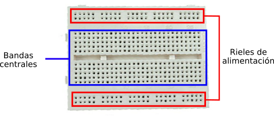
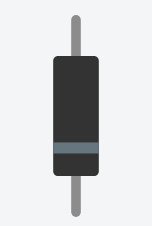

## Introducción

Diversos componentes electrónicos se encuentran interconectados para lograr aplicaciones como por ejemplo el televisor de casa o la computadora. Por dentro de ellos podemos encontrar tarjetas con resistencias, condensadores, circuitos integrados, transistores, entre otros.

## Protoboard

Es una placa reutilizable usada para construir prototipos de circuitos electrónicos sin soldadura. Compuestas por bloques de plástico perforados y numerosas láminas delgadas de una aleación de cobre, estaño y fósforo. En la figura superior se puede observar la apariencia externa de la protoboard y algunos de tantos nombres que reciben sus conexiones. Los rieles de alimentación se llaman así porque usualmente se conectan a la corriente de alimentación. La propia protoboard incluye un etiquetado donde sugiere cuál riel debe ser conectado al voltaje y cuál a tierra. En las bandas centrales es donde se arma el circuito en cuestión. 

Las conexiones internas de la tablilla se muestran debajo:

Observemos que existen dos líneas o conexiones paralelas que corren por arriba y otras dos exactamente iguales que lo hacen por abajo. Se corresponden con los rieles. También notemos que las bandas centrales son perpendiculares a estos.

## Resistencias

Es un material formado por carbón y otros elementos resistivos para disminuir la corriente que pasa. Se opone al paso de la corriente. La corriente máxima en un resistor viene condicionado por la máxima potencia que puede disipar su cuerpo. Esta potencia se puede identificar visualmente a partir del diámetro sin que sea necesaria otra indicación. Los valores más comunes son 0,25 W, 0,5 W y 1 W.

El valor de la resistencia eléctrica se obtiene leyendo las cifras como un número de una, dos o tres cifras; se multiplica por el multiplicador y se obtiene el resultado en Ohmios (Ω).

### Tabla de colores de las resistencias

Las resistencias pueden ser identificadas mediante sus bandas de color. En específico, existen modelos con tres, cuatro y cinco bandas, siendo la posición y color de cada una un indicativo de la resistencia del dispositivo. A continuación, se muestra la tabla de colores y unos ejemplos al final.

| Color de banda | Valor de 1° dígito | Valor de 2° dígito | Multiplicador | Tolerancia |
| :------------: | :----------------: | :----------------: | ------------: | :--------: | 
| Negro | - | 0 | 1 | - |
| Marrón | 1 | 1 | 10 | $\pm1$% |
| Rojo | 2 | 2 | 100 | $\pm2$% |
| Naranja | 3 | 3 | 1,000 | - |
| Amarillo | 4 | 4 | 10,000 | $\pm4$% |
| Verde | 5 | 5 | 100,000 | $\pm0.5$% |
| Azul | 6 | 6| 1'000,000 | $\pm0.25$% |
| Violeta | 7 | 7 | 10'000,000 | $\pm0.1$% |
| Gris | 8 | 8 | 100'000,000 | $\pm0.05$% |
| Blanco | 9 | 9 | 1,000'000,000 | - |
| Dorado | - | - | 0.1 | $\pm5$% |
| Plateado | - | - | 0.01 | $\pm10$% |
| Ninguno | - | - | - | $\pm20$% |

#### Ejemplos de lectura de resistencias

Veamos a continuación cómo se leen algunas resistencias. Para ello, a continuación se muestran cuatro de ellas y las leeremos de izquierda a derecha.

1. Primera banda, marrón: primera cifra = 1; segunda banda, rojo: segunda cifra = 2; tercera banda, marrón: multiplicar por 10 = (12)(10) = 120; cuarta banda, dorado: tolerancia de $\pm$5%, es decir, (120)(0.05) = 6$\Omega$. Esta primera resistencia es de 120$\Omega\pm$5%, es decir, se encuentra entre 114 y 126$\Omega$.

2. Primera banda, amarillo: primera cifra = 4; segunda banda, violeta: segunda cifra = 7; tercera banda, marrón: multiplicar por 10 = (47)(10) = 470; cuarta banda, dorado: tolerancia de $\pm$5%, es decir, (470)(0.05) = 23.5$\Omega$. La segunda resistencia es de 470$\Omega\pm$5%, es decir, se encuentra entre 446.5 y 493.5$\Omega$.

3. Primera banda, marrón: primera cifra = 1; segunda banda, negro: segunda cifra = 0; tercera banda, rojo: multiplicar por 100 = (10)(100) = 1,000; cuarta banda, dorado: tolerancia de $\pm$5%, es decir, (1,000)(0.05) = 50$\Omega$. La tercera resistencia es de 1,000$\Omega\pm$5%, es decir, se encuentra entre 950 y 1,050$\Omega$. Cabe mencionar que no se acostumbra escribir 1,000 $\Omega$, más bien, es más común escribirlo como 1k$\Omega$.

4. Primera banda, marrón: primera cifra = 1; segunda banda, negro: segunda cifra = 0; tercera banda, naranja: multiplicar por 1,000 = (10)(1,000) = 10,000; cuarta banda, dorado: tolerancia de $\pm$5%, es decir, (10,000)(0.05) = 500$\Omega$. La cuarta resistencia es de 10,000$\Omega\pm$5%, es decir, se encuentra entre 9,500 y 10,500$\Omega$. Esto se escribiría típicamente como 10k$\Omega$.

Existen varios tipos de resistencias, algunas son variables y otras dependen de la temperatura o la cantidad de luz que incide sobre ellas.

## Diodo

Es un componente electrónico de dos terminales que permite la circulación de la corriente eléctrica a través de él en un solo sentido. Tiene dos partes, ambas son electrodos: el cátodo y el ánodo. Un tipo diferente pero bastante común es el diodo Zener, el cual sí permite el flujo eléctrico en otra dirección, pero solo después de haber superado un voltaje específico.

## Transistor

 

El transistor es un dispositivo electrónico semiconductor que cumple funciones de amplificador (intensifica señales), oscilador, conmutador o rectificador. El término "transistor" es la contracción en inglés de transfer resistor ("resistencia de transferencia"). Tiene tres partes: la base (B), el emisor (E) y colector (C). 

Actualmente se encuentran prácticamente en todos los aparatos domésticos de uso cotidiano: radios, grabadoras, reproductores de audio y video, hornos de microondas, lavadoras, automóviles, equipos de refrigeración, alarmas, relojes de cuarzo, ordenadores, calculadoras, impresoras, lámparas fluorescentes, equipos de rayos X, tomógrafos, ecógrafos, teléfonos celulares, entre otros.

## Microcontroladores

Un microcontrolador (abreviado μC,UC o MCU) es un circuito integrado programable, capaz de ejecutar las órdenes grabadas en su memoria. Está compuesto de varios bloques funcionales, los cuales cumplen una tarea específica. Un microcontrolador incluye en su interior las tres unidades funcionales principales: __unidad central de procesamiento (CPU)__, __memoria__ y __periféricos de entrada y salida__.

Para que pueda controlar algún proceso es necesario generar o crear y luego grabar en la memoria _EEPROM_ del microcontrolador algún programa, el cual puede ser escrito en lenguaje ensamblador u otro lenguaje para microcontroladores; sin embargo, para que el programa pueda ser grabado en la EEPROM del microcontrolador, debe ser codificado en sistema numérico hexadecimal, que es finalmente el sistema que hace trabajar al microcontrolador cuando éste es alimentado con el voltaje adecuado y, está asociado a dispositivos analógicos y discretos para su funcionamiento.

Los microcontroladores representan la inmensa mayoría de los chips vendidos, hablamos sobre un 50% que son controladores "simples" y el restante corresponde a más especializados. Mientras se pueden tener uno o dos microprocesadores de propósito general en casa (para leer esto estamos usando uno), tenemos distribuidos seguramente entre todos los electrodomésticos del hogar una o dos docenas de microcontroladores. Pueden encontrarse en casi cualquier dispositivo electrónico como automóviles, lavadoras, hornos microondas, teléfonos, Arduino, etc.

Los microcontroladores utilizan la mayoría de su chip para incluir funcionalidad, como los dispositivos de entrada/salida o la memoria que incluye el microcontrolador, con la gran ventaja de que se puede prescindir de cualquier otra circuitería externa.

Los puertos de E/S (entrada/salida) en el microcontrolador, generalmente se agrupan en puertos de 8 bits de longitud, lo cual permite leer datos del exterior o escribir en ellos desde el interior del microcontrolador, el destino habitual es el trabajo con dispositivos simples como relés, LED, motores, fotoceldas, pulsadores o cualquier otra cosa que se le ocurra al programador.

