## Introducción

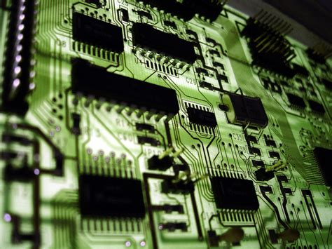

La Electrónica es la rama de la física y especialización de la ingeniería, que estudia y emplea sistemas cuyo funcionamiento se basa en la conducción y el control del flujo microscópico de los electrones u otras partículas cargadas eléctricamente.

Utiliza una gran variedad de conocimientos, materiales y dispositivos, desde los semiconductores hasta las válvulas termoiónicas. El diseño y la construcción de circuitos electrónicos para resolver problemas prácticos forman parte de la electrónica y de los campos de la ingeniería electrónica, electromecánica y la informática en el diseño de software para su control. 

La electrónica desarrolla en la actualidad una gran variedad de tareas. Los principales usos de los circuitos electrónicos son el control, el procesado, la distribución de información, la conversión y la distribución de la energía eléctrica. Estos dos usos implican la creación o la detección de campos electromagnéticos y corrientes eléctricas.

## Conceptos básicos

A continuación abordaremos unos cuantos conceptos fundamentales para comenzar a desarrollar aplicaciones con dispositivos embebidos.

### Voltaje (V)

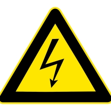

Una magnitud física que impulsa a los electrones a lo largo de un conductor en un circuito eléctrico cerrado, provocando el flujo de una corriente eléctrica. Su unidad es el Voltio(V). El instrumento usado para medir el voltaje se conoce como voltímetro.

### Corriente (I)

Es el flujo de electrones libres a través de un conductor o semiconductor en un sentido. La unidad de medida de ésta es el amperio (A). Una corriente eléctrica, puesto que se trata de un movimiento de cargas, produce un campo magnético, un fenómeno que puede aprovecharse en el electroimán, este es el principio de funcionamiento de un motor.

#### Corriente Continua (CD o DC)

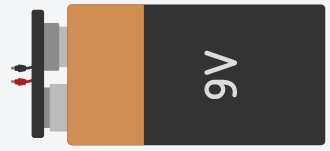

Es el flujo continuo de electrones a través de un conductor entre dos puntos de distinto potencial. En la corriente continua las cargas eléctricas circulan siempre en la misma dirección, es continua toda corriente que mantenga siempre la misma polaridad. En la norma el color negro corresponde al negativo y el rojo al positivo o sencillamente se simboliza para el positivo con VCC, +, VSS y para el negativo con 0V, -, GND.

Muchos aparatos necesitan corriente continua para funcionar, sobre todos los que llevan electrónica (equipos audiovisuales, computadores, etc.), para ello se utilizan fuentes de alimentación que rectifican y convierten la tensión a una adecuada. Este tipo de corriente la podemos encontrar en la baterías, pilas o salida de los cargadores de computadora o celular.

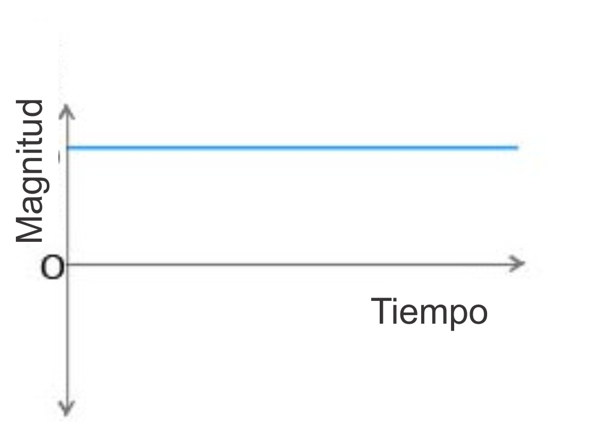

#### Corriente alterna (AC)

Es la corriente eléctrica en la que la magnitud y dirección varían cíclicamente. La forma de onda de la corriente alterna más comúnmente utilizada es la de una onda sinusoidal.

Utilizada genéricamente, la AC se refiere a la forma en la cual la electricidad llega a los hogares y a las empresas, es muy común encontrarla en las tomas de corriente donde se conectan nuestros electrodomésticos. Sin embargo, las señales de audio y de radio transmitidas por los cables eléctricos son también ejemplos de corriente alterna. En estos usos, el fin más importante suele ser la transmisión y recuperación de la información codificada (o modulada) sobre la señal de la AC.

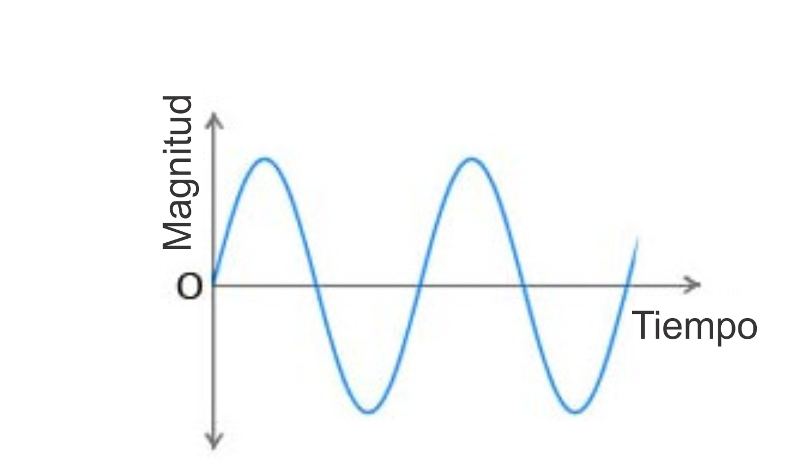

### Resistencia (R)

Es la propiedad física mediante la cual todos los materiales tienden a oponerse al flujo de la corriente. La unidad de este parámetro es el Ohmio (Ω). Podemos encontrar resistencias en los calefactores eléctricos, tarjetas electrónicas, planchas o tostadores. Son muy útiles para limitar el paso de la corriente y el voltaje.

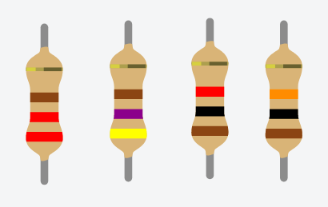

### La Ley de Ohm

La ley dice que la corriente (I) que circula por un conductor eléctrico es directamente proporcional al voltaje (V) e inversamente proporcional a la resistencia (R).

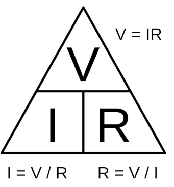

La pirámide de la ilustración es muy útil para conocer la fórmula a la que es igual la variable que tapemos con el dedo, por ejemplo: Tapamos con el dedo la V (voltaje), entonces voltaje va a ser igual a I (corriente) por R (resistencia). Una más, tapamos I (Corriente), I va ser igual a V divido entre R.

### Sistemas electrónicos

Un sistema electrónico es un conjunto de circuitos que interactúan entre sí para obtener un resultado. Una forma de entender los sistemas electrónicos consiste en dividirlos en entradas, salidas y procesamiento de señal.

#### Entradas

Las entradas o Inputs: Son sensores electrónicos o mecánicos que toman las señales en forma de temperatura, presión, humedad, contacto, luz, movimiento, pH, presencia de gases, etc., a partir del mundo físico y las convierten en señales de corriente o
voltaje. 

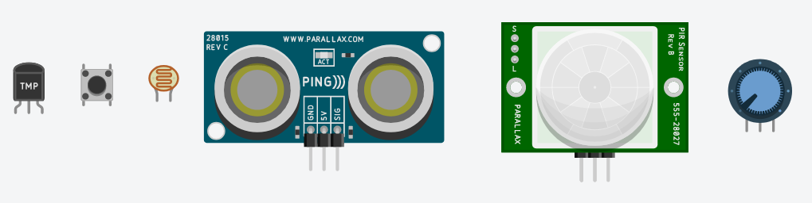

#### Salidas

Las salidas o Outputs: Son actuadores u otros dispositivos que convierten las señales de corriente o voltaje en señales físicamente útiles como movimiento, luz, sonido, fuerza, rotación, entre otros.

Por ejemplo: un display que registre la temperatura, un LED o sistema de luces que se encienda automáticamente cuando esté oscureciendo, un motor, o un buzzer que genere diversos tonos.

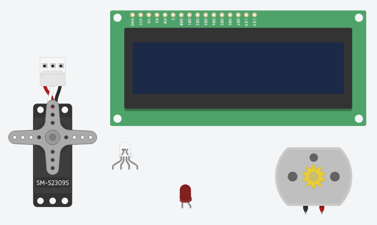

#### Procesamiento de señal

Se realiza mediante circuitos generalmente conocidos como microcontroladores. Consisten en piezas electrónicas conectadas juntas para manipular, interpretar y transformar las señales de voltaje y corriente provenientes de los sensores (Entradas) y tomar las respectiva decisiones para generar acciones en las salidas.

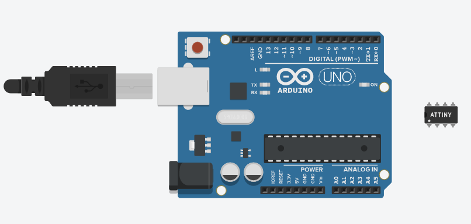

#### Señales electrónicas

Son la representación de un fenómeno físico. Las entradas y salidas de un sistema electrónico serán consideradas como las señales variables. En electrónica se trabaja con variables que se toman en forma de voltaje o corriente, éstas se pueden denominar comúnmente señales y primordialmente pueden ser de dos tipos: analógicas y digitales.

##### Señales analógicas

Son aquellas que pueden tomar un número infinito de valores comprendidos entre dos límites. La mayoría de los fenómenos de la vida real son señales de este tipo, tales como el sonido, la temperatura, la voz o el video.

Un ejemplo de sistema electrónico analógico es el altavoz, que se emplea para amplificar el sonido de forma que éste sea oído por una gran audiencia. Las ondas de sonido que son analógicas en su origen, son capturadas por un micrófono y convertidas en una pequeña variación analógica de tensión denominada señal de audio.

##### Señales digitales

También llamadas variables discretas. Se caracterizan por tener dos estados diferenciados y por lo tanto se pueden llamar binarias. Siendo estas variables más fáciles de tratar (en lógica serían los valores Verdadero (V) y Falso (F) o podrían ser 1 o 0 respectivamente).

Un ejemplo de una señal digital es el interruptor de la lámpara de nuestra casa, ya que este interruptor solo tiene dos estados: encendido y apagado.

##### Conversor análogo-digital

Un conversor (o convertidor) analógico-digital (CAD), (o también ADC del inglés "Analog-to-Digital Converter") es un dispositivo electrónico capaz de convertir una entrada analógica de voltaje en un valor binario. Se utiliza en equipos electrónicos como computadores, grabadores de sonido y de vídeo, y equipos de telecomunicaciones. La señal analógica, que varía de forma continua en el tiempo, se conecta a la entrada del dispositivo y se somete a un muestreo a una velocidad fija, obteniéndose así una señal digital a la salida del mismo.

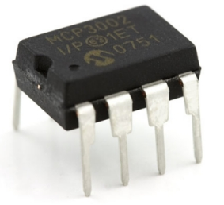

#### Módulación por ancho del pulso PWM

La modulación por ancho de pulsos (también conocida como PWM, siglas en inglés de pulse-width modulation) de una señal o fuente de energía es una técnica en la que se modifica el ciclo de trabajo de una señal periódica (una senoidal o una cuadrada, por ejemplo), ya sea para transmitir información a través de un canal de comunicaciones o para controlar la cantidad de energía que se envía a una carga.

Por ejemplo si le aplicamos PWM a un LED podemos variar su intensidad de brillo y si le aplicamos un PWM a un motor DC logramos variar la velocidad del mismo con la característica de mantener su par (fuerza) constante.

#### Comunicación serial

Es una interfaz de comunicaciones de datos digitales, frecuentemente utilizado por computadoras y periféricos, donde la información es transmitida bit a bit enviando un solo bit a la vez. Uno de sus usos es monitorear a través de la pantalla de la computadora el estado del periférico conectado, por ejemplo al pulsar la letra A en el teclado se debe accionar un LED conectado de manera remota a la computadora.

