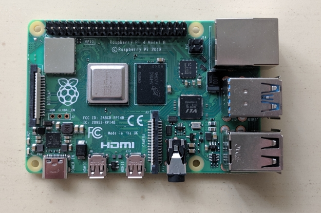

## Introducción

Un sistema embebido se corresponde con un sistema informático que ha sido diseñado y construido con una función única, o quizás unas cuantas de ellas, pero todas dedicadas. Otras de sus características son que el sistema trabaja en tiempo real y todos los componentes se encuentran en la propia placa base. Es decir, los puertos de conexión a la red, los puertos USB, el _hardware_ de salida de audio y video, etcétera, se encuentran incluidos ya en la placa, la cual tiene un tamaño aproximado al de una credencial de identificación INE o una tarjeta de crédito.

### Diferentes tipos de sistemas embebidos

Los sistemas que mayor auge tienen en la actualidad se pueden dividir en dos tipos diferentes, cuya distinción se hace con base en si utilizan un microcontrolador o un microprocesador como unidad central. Entre los primeros se encuentra como principal representante la placa Arduino, y entre los segundos la Raspberry Pi. A continuación se muestra una tabla comparativa entre ambos sistemas.

| Característica | Microcontrolador | Microprocesador | 
| :------------- | :-------------- | :--------------- |
| Velocidad de operación | Su frecuencia es del orden de los MHz | Su frecuencia es del orden de los GHz |
| Elementos necesarios | Usualmente solo necesitan ser energizados | Necesitan una memoria RAM, una ROM y un decodificador de direcciones |
| Costo | Bajo, oscilando entre $\$120$ y $\$400$ | Medio, entre $\$700$ y $\$1,500$ |
| Afectación por ruido magnético | Poca | Media, al requerir mayor cantidad de conexión entre sus componentes |
| CPU | Capacidad de procesamiento bajo, ideal para monotareas | Ideal para procesamiento de datos |
| Memoria RAM y ROM | Se incluye en el microcontrolador | Necesarias, pero añadidas por separado en la placa base |

Con lo anterior, podemos concluir que para una aplicación en la que sea necesario monitorear el exterior por medio de sensores o controlar algún proceso por medio de motores, lo más conveniente es usar un microcontrolador (Arduino); pero si lo que se busca es procesar un conjunto de datos, implementar una interfaz gráfica de usuario o transferir información por medio de internet, un microprocesador (Rasberry) sería lo más conveniente, aunque también es posible integrar ambos de ser necesario.

### Hardware libre

Se llama hardware libre a los dispositivos de hardware cuyas especificaciones y diagramas esquemáticos son de acceso público, ya sea bajo algún tipo de pago o de forma gratuita. La filosofía del software libre (las ideas sobre la libertad del conocimiento) es aplicable a la del hardware libre. Se debe recordar en todo momento que libre no es sinónimo de gratis. El hardware libre forma parte de la cultura libre.

Dado que el hardware tiene asociados a él costos variables directos, ninguna definición de software libre se puede aplicar directamente sin modificación. En cambio, el término hardware libre se ha usado principalmente para reflejar el uso del software libre con el hardware y el lanzamiento libre de la información con respecto al hardware, a menudo incluyendo el lanzamiento de los diagramas esquemáticos, diseños, tamaños y otra información acerca del hardware.

### Software libre

El software libre (en inglés free software, aunque esta denominación también se confunde a veces con "gratis" por la ambigüedad del término "free" en el idioma inglés, por lo que también se usa "libre software" y "logical libre") es la denominación del software que respeta la libertad de los usuarios sobre su producto adquirido y, por tanto, una vez obtenido puede ser usado, copiado, estudiado, modificado, y redistribuido libremente. Según la Free Software Foundation, el software libre se refiere a la libertad de los usuarios para ejecutar, copiar, distribuir, estudiar, modificar el software y distribuirlo modificado.

