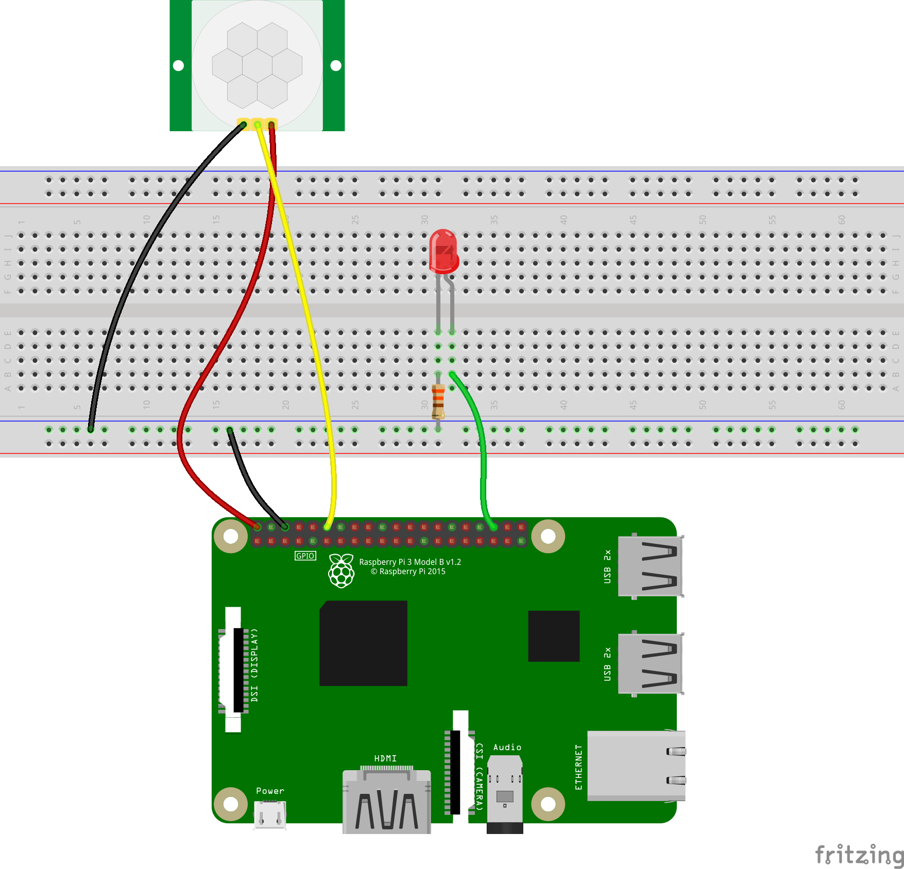
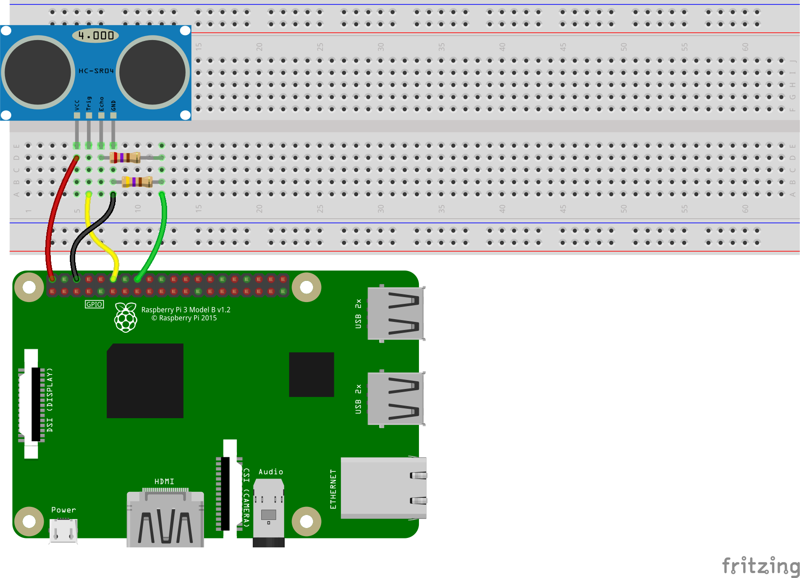

## Introducción a la Raspberry Pi.

### Componentes básicos

A continuación se muestra una lista con los componentes que deben tenerse a mano para comenzar con la manipulación de la pequeña placa embebida:

- La propia _Raspi_.
- Un alimentador de corriente _micro-USB_ de 5V y al menos 1.2A.
- Cable _HDMI_.
- Tarjeta _microSD_ de al menos 8GB de capacidad y clase 4.
- Teclado y ratón _USB_.
- Monitor con entrada HDMI, aunque imprescindible al principio, pierde importancia si se cuenta con una conexión a internet y a un visor remoto.

Las características indicadas para la tarjeta de memoria son las mínimas. Si se cuenta con una tarjeta de mayores prestaciones es recomendable utilizarla.

## Instalación del Sistema Operativo

### Preparando todo

El primer paso es formatear la tarjeta SD mediante cualquier aplicación que se tenga a la mano (no formatear con algún teléfono celular). Acto seguido, dirigirse a la página de la Fundación Raspberry Pi <https://www.raspberrypi.org/> y luego a la sección de _Descargas_. 

 

En dicha sección obtendremos el sistema operativo que instalaremos en la tarjeta SD. De las dos opciones que saltan a la vista, nos quedaremos con la descarga de Raspbian (debemos asegurarnos que es la versión para Raspi, más abajo está otra que es para PC, **no bajar esa última**). 


Al dar clic en la imagen nos brindará tres opciones. Por cuestiones de facilidad, escogemos la versión completa «_with desktop and recommended software_». Es recomendable que al terminar la descarga, **no** se descomprima. 

### Instalando el sistema operativo

El archivo _zip_ será muy pesado y lento para hacerlo. Lo ideal es utilizar una aplicación llamada _Etcher_, la cual es libre y puede descargarse de su página oficial: <https://www.balena.io/etcher/>. La aplicación es sumamente sencilla de utilizar: en la misma pantalla se selecciona la imagen a montar, luego la tarjeta (si solo hay insertada una tarjeta SD, esa será seleccionada por defecto). Clic en _Flash!_ y listo.


### ¡Está viva!

Insertamos la tarjeta en la ranura adecuada de la Raspi. Conectamos el cable _HDMI_ y los periféricos enlistados arriba. La alimentación de corriente se conecta al final. Al realizarse esto último deben encenderse dos _leds_ de la placa: uno rojo y uno verde. El rojo indica que está energizada. El verde debe estar parpadeando y así indica lectura de la tarjeta SD. Por otro lado, en el monitor debió aparecer un flash multicolor, señal de que la salida de video es correcta. Esperamos un poco a que cargue todo y debería aparecer algo así en pantalla:


La ventana que aparece en la captura es el gestor de configuración de la _Raspberry_. Es buena idea adecuar la localización al país de uso (México) en la última pestaña. Con eso hecho, hay que ejecutar unos cuantos comandos para irse familiarizando con el sistema operativo (el cual es **Linux**). Conectamos la placa a internet mediante WiFi o ethernet, actualizamos la lista de repositorios y enseguida actualizamos el sistema.

### Actualizando y limpiando el sistema

Actualizar los repositorios nos sirve para encontrar las actualizaciones disponibles para el software instalado. En sistemas _Linux_ basados en _Debian_ (tales como Raspbian, Ubuntu, Linux Mint o Kali) esto se realiza mediante el comando:

```bash
sudo apt update
```

Para aplicar las actualizaciones disponibles se ejecuta:

```bash
sudo apt upgrade
```

En caso de ser necesario instalar alguna aplicación, esto se hace con:

```bash
sudo apt install aplicación-necesaria
```

Si instalamos algo innecesario podemos eliminarlo con:

```bash
sudo apt remove aplicación-innecesaria
```

Y si queremos eliminar dependencias de aplicaciones eliminadas:

```bash
sudo apt autoremove
```

## Los pines GPIO

Tenemos disponible y en nuestras manos la versión 3 de la placa. Ya tiene incluidas las conexiones WiFi y Bluetooth, por lo que ya no es necesario comprar los módulos pertinentes. Lo que más nos interesa son los pines que sobresalen bastante de la misma placa. Les llamamos **GPIO**. Son las conexiones que nos permitirán controlar motores y focos o recibir mediciones de los sensores conectados. **Es muy importante tener a la mano la numeración de los mismos, ya que _no sigue un orden físico_**. El orden de los GPIO –mirando la raspi desde arriba y con los puertos USB apuntando al suelo–, es el siguiente:


|    Etiqueta | Posición física | Posición física | Etiqueta    |
| ----------: | :-------------: | :-------------: | :---------- |
|        3.3V |        1        |        2        | 5V          |
|       GPIO2 |        3        |        4        | 5V          |
|       GPIO3 |        5        |        6        | GND         |
|       GPIO4 |        7        |        8        | GPIO14      |
|         GND |        9        |       10        | GPIO15      |
|      GPIO17 |       11        |       12        | GPIO18      |
|      GPIO27 |       13        |       14        | GND         |
|      GPIO22 |       15        |       16        | GPIO23      |
|        3.3V |       17        |       18        | GPIO24      |
|      GPIO10 |       19        |       20        | GND         |
|       GPIO9 |       21        |       22        | GPIO25      |
|      GPIO11 |       23        |       24        | GPIO8       |
|         GND |       25        |       26        | GPIO7       |
| DNC (GPIO0) |       27        |       28        | DNC (GPIO1) |
|       GPIO5 |       29        |       30        | GND         |
|       GPIO6 |       31        |       32        | GPIO12      |
|      GPIO13 |       33        |       34        | GND         |
|      GPIO19 |       35        |       36        | GPIO16      |
|      GPIO26 |       37        |       38        | GPIO20      |
|         GND |       39        |       40        | GPIO21      |

Donde el número enseguida de la palabra GPIO es el número de GPIO al que debemos hacer referencia cuando lo utilicemos en el código. Por ejemplo, el GPIO18 es el que físicamente ocupa la posición 12. Pero si en nuestro código ponemos 12 como identificador, en realidad estaremos referenciando físicamente al pin 32.

## Práctica 1. Encendiendo un LED

### Material necesario

- Raspberry Pi $3$ con los componentes básicos
- Librería _GPIO Zero_ en _Python3_
- Tablilla de prototipado
- Un LED (de preferencia rojo)
- Una resistencia de $330\Omega$
- Dos cables _jumper_ macho-hembra

### El circuito

El circuito es sumamente sencillo. Solo hay que asegurarse de que se respeta la polaridad del LED: la patita más corta debe conectarse a la resistencia y luego a tierra (_GND_) y la otra al GPIO elegido (_GPIO18_). 


### El código para encender

El código es también bastante sencillo. Para comenzar a programar abrimos _Menú Inicio > Desarrollo > Python 3 (IDLE)_. Creamos un archivo nuevo _File > New File_ y lo guardamos _(File > Save)_ con el nombre que queramos en una ubicación sencilla de acceder. 

El código consta primero de la importación de la clase `LED` desde la librería `GPIO Zero`.

```python
from gpiozero import LED
```

Asignamos la variable `led` al `GPIO18`.

```python
led = LED(18)
```

Encendemos el LED con el método `on()`.

```python
led.on()
```

Presionamos _F5_ para ejecutar el código y el LED debería encenderse. Podemos detener el programa con la combinación _CTRL + C_. El código completo debería verse así:

```python
from gpiozero import LED
led = LED(18)
led.on()
```

### El código para parpadear

Comenzamos importando la clase `LED`. Después importamos la función `sleep` desde la librería `time`.

```python
from time import sleep
```

Asignamos la misma variable al mismo `GPIO` del código anterior, pero ahora no mantendremos encendido el LED de manera permanente, si no que lo haremos parpadear con un segundo de diferencia. Para ello haremos uso de un _loop_ infinito que encienda y apague el LED en intervalos iguales de 1, utilizando los métodos `on()` y `off()` y para permanecer un segundo la función `sleep(1)`.

```python
while True:
    led.on()
    sleep(1)
    led.off()
    sleep(1)
```

Presionamos _F5_ para ejecutar el código y el LED debería estar parpadeando. El código final debería verse así:

```python
from gpiozero import LED
from time import sleep

led = LED(18)

while True:
    led.on()
    sleep(1)
    led.off()
    sleep(1)
```

### Un código más sencillo (incluso)

Podemos conseguir el mismo efecto con menos líneas de código, utilizando el método `blink()`.

``` python
from gpiozero import LED
from signal import pause

led = LED(18)

led.blink()

pause()
```

El método permite especificar el tiempo de encendido, de apagado, número de parpadeos y si se ejecuta como un subproceso de fondo.

```python
blink(on_time=1, off_time=1, n=None, background=True)
```

### Evidencia de producto

Documente el procedimiento para controlar el encendido de un LED mediante la Raspberry Pi. Incluya imágenes del circuito real y el código utilizado.

## Práctica 2. Programando secuencias: un semáforo

### Material necesario

- Raspberry Pi $3$ con los componentes básicos
- Librería _GPIO Zero_ en _Python3_
- Tablilla de prototipado
- Tres LED's (uno de cada color -verde, amarillo y rojo-)
- Tres resistencias de $330\Omega$ 
- Cuatro cables jumper macho-hembra

### El circuito

Prácticamente es el mismo circuito que la práctica anterior, pero triplicado.


### Código propuesto

```python
from gpiozero import LED
from time import sleep

rojo = LED(14)
ambar = LED(15)
verde = LED(18)

verde.on()
ambar.off()
rojo.off()

while True:
    sleep(10)
    verde.off()
    ambar.on()
    sleep(1)
    ambar.off()
    rojo.on()
    sleep(10)
    ambar.on()
    sleep(1)
    verde.on()
    ambar.off()
    rojo.off()
```

### Evidencia de producto

Modifique el semáforo programado, para mejorar su comportamiento y acercarlo al de un semáforo más realista. Documente el proceso con imágenes y el código empleado.

## Práctica 3. Controlando remotamente la Raspberry

### Material necesario

- La Raspberry Pi con los componentes básicos
- Una conexión a internet estable y permanente
- El dispositivo que servirá como cliente visor (una laptop, un celular, _tablet_, etc)

### Preparando el servidor

Uno de los inconvenientes de trabajar con la placa es que es necesario conectarla a un monitor externo. En ocasiones es bastante incómodo o complicado. Sin embargo, teniendo una conexión estable y permanente a internet se puede resolver el problema. Encienda la Raspberry y asegúrese de que el servidor VNC se encuentre habilitado. Es fácil: el icono se encontrará coloreado en la bandeja, al lado de los indicadores de conexión a internet y _bluetooth_. Si se encuentra sombreado significa que está activado pero no hay acceso a la red. Si simplemente no se encuentra el indicador es porque no está activado VNC Server. Para activarlo, nos dirigimos a _Menú Inicio -> Preferencias -> Configuración de Raspberry Pi_. Aparecerá una ventana con cuatro pestañas, pero las que nos interesan son la de  _Sistema_ y la de _Interfaces_. Nos dirigimos a la primera y damos clic en el botón de _Cambiar Clave_, ahí nos pedirá que ingresemos la nueva contraseña para evitar intrusos, no olvidarla. Ahora nos vamos a la pestaña _Interfaces_ y nos aseguramos de activar _SSH_ y _VNC_. Le damos en aceptar y reiniciamos la Raspberry. Al volver a entrar a Raspbian, ya debería estar activo el servidor. 

### Preparando el cliente

Ahora es necesario preparar el dispositivo por el cual se desplegará remotamente el escritorio de la Raspberry Pi. Debemos descargar la aplicación adecuada (si es una laptop asegurarnos de descargar la versión adecuada al sistema operativo, en el caso de utilizar un teléfono celular, existen versiones disponibles para _Android_ y para _iOS_, incluso para el navegador _Chrome_) desde la página oficial de VNC:  [https://www.realvnc.com/es/connect/download/viewer/](https://www.realvnc.com/es/connect/download/viewer/). Instalamos la aplicación y la ejecutamos (debemos aceptar una licencia) .

### Visualizando la Raspberry sin monitor

Ya estando activo el servidor en la raspberry, nos dirigimos a donde se encuentra el indicador en la barra de tareas. Damos clic derecho y enseguida se abre una ventana con la información de la raspberry en cuanto a la conexión. Nos interesa la dirección IP. La copiamos porque a ella nos conectaremos con el visor.

Ahora nos vamos al cliente y ahí accedemos a la ventana principal (después de cerrar la de bienvenida). En la caja de texto introducimos la dirección IP de la raspberry, tomando en cuenta que ambos dispositivos, cliente y servidor, deben estar conectados a la misma red. Nos pedirá que aceptemos conectarnos al servidor ya que no se ha detectado una conexión anterior. Aceptamos y enseguida debemos aportar las credenciales necesarias, el usuario por defecto es **pi**, mientras que la contraseña es la que se cambió en la primera parte de la práctica. Al ser autenticados, debe verse ya el escritorio de la raspberry en la pantalla del dispositivo cliente.

### Acceder remotamente a la Raspberry en todo sentido

Existe una manera de acceder remotamente con un dispositivo cliente a la raspberry sin que se encuentren ambos conectados a la misma red. Esto sería muy útil también para cuando la placa no estará conectada a un monitor y no se puede saber la dirección IP y/o no se quiere fijar la misma. Para ello es necesario crearse una cuenta desde el dispositivo cliente en la página de RealVNC [https://www.realvnc.com/es/](https://www.realvnc.com/es/), o desde la propia Raspberry en el indicador VNC, dando clic derecho y entrando a _Aplicación de licencias_. En la primera opción damos clic en «regístrese en línea» y se abrirá el navegador _Chromium_ con las instrucciones pertinentes. 


Con la cuenta ya creada, volvemos a ese apartado y seleccionamos la misma primera opción, damos clic en _Next_ e introducimos nuestras credenciales. Ahora volvemos al cliente y con el visor ejecutado, damos clic en _Iniciar sesión_. Introducimos nuestros datos y autorizamos la conexión tanto en el correo que se nos enviará como en VNC Viewer. Posteriormente damos clic en el apartado donde aparece nuestro nombre registrado (aparece como _Usuario's Team (Home)_). A la derecha estarán los dispositivos enlazados a la cuenta, damos doble clic y estaremos ya frente al escritorio de la Raspi.


## Práctica 4. Recibiendo la señal de un botón _push_

### Material necesario

- Raspberry Pi $3$
- Librería _GPIO Zero_ en _Python3_
- Tablilla de prototipado
- Un botón tipo _push_  
- Dos cables jumper macho-hembra
- Un cable jumper macho-macho

### El circuito

El botón no tiene polaridad. Si es de cuatro pines hay que insertarlo en el canal central de la tablilla, de modo que dos pines queden en una mitad y los restantes en la otra. Si es de dos pines no es importante la ubicación.


### Código para «leer» el botón

Primero importamos la clase `Button` desde `gpiozero`.

```python
from gpiozero import Button
```

Asignamos la variable _boton_ al `GPIO18`:

```python
boton = Button(18)
```

Y ahora agregamos el método `wait_for_press()` para que el `script` se detenga hasta que el botón se active al ser presionado. Agregamos un mensaje que nos avise que el botón fue activado:

```python
boton.wait_for_press()
print("El botón ha sido presionado")
```

### Métodos disponibles

```python
wait_for_release(timeout=None)
```

Comportamiento análogo al método `wait_for_press`, con la salvedad de que pausa el `script` hasta que el botón es desactivado o el `timeout` es alcanzado.

```python
when_pressed
```

La función a correr cuando el botón cambia de inactivo a activo.

```python
when_released
```

La función a correr cuando el botón cambia de activo a inactivo.

### Un ejemplo de uso

Esperar el cambio de estado del botón y avisar sobre dicho cambio:

```python
from gpiozero import Button
button = Button(18)

while True: 
     if button.is_pressed:
         print("Botón presionado")
	 else:
         print("Botón no presionado")
```

## Práctica 5. Encendiendo un LED con un botón

### Material necesario

- Raspberry Pi $3$
- Librería _GPIO Zero_ en _Python3_
- Tablilla de prototipado
- Un botón tipo _push_  
- Un LED (de preferencia rojo)
- Cuatro cables jumper macho-hembra
- Un cable jumper macho-macho
- Una resistencia de $330\Omega$

Utilice lo visto anteriormente y diseñe una aplicación que encienda al LED solo al pulsar un botón. Así mismo, al soltar el botón, el LED debe apagarse.

## Práctica 6. Controlando un LED RGB

### Material necesario

- Raspberry Pi $3$
- Librería _GPIO Zero_ en _Python3_
- Tablilla de prototipado
- Un LED RGB.
- Cuatro cables jumper macho-hembra
- Tres resistencias de $220\Omega$

### El circuito

Es relativamente sencillo el armado, solo hay que mencionar que el LED RGB tiene cuatro pines, de los cuales, el más largo se corresponde con _tierra_. Si estamos viendo el LED de «frente», dicho pin será el segundo, contando de izquierda a derecha. Los demás se corresponden a la secuencia _RGB_, es decir: rojo el primero, verde el tercero y azul el último.

Contrario al LED normal, en este caso conectaremos las resistencias a los pines que irán a los GPIO, como se muestra a continuación:


### El código

Definimos nuestra variable y jugamos con los parámetros de la clase `RGBLED`, tomando en cuenta que los mismos se corresponden con la intensidad de los colores _rojo, verde_ y _azul_.

```python
from gpiozero import RGBLED
from time import sleep

led = RGBLED(14,15,18)
led.red = 1
sleep(1)
led.red = 0.5
sleep(1)

led.color = (0, 1, 0)
sleep(1)
led.color = (1, 0, 1)
sleep(1)
led.color = (1, 1, 0)
sleep(1)
led.color = (0, 1, 1)
sleep(1)
led.color = (1, 1, 1)
sleep(1)
led.color = (0, 0, 0)
sleep(1)

for n in range(100):
    led.blue = n/100
    sleep(0.1)
```

## Práctica 7. Sensor de movimiento

### Lista de materiales

- Tablilla de prototipado
- Un LED
- Una resistencia de $330\Omega $
- Un sensor PIR HC-SR501

### El circuito

Mucho cuidado con la polaridad del sensor. Aunque se alimenta con $5V$, entrega solo $3.3V$, así que no requiere un circuito adicional. La resistencia es para proteger la _raspi_ de la carga absorbida por el LED.



### El código

``` python
from gpiozero import MotionSensor, LED
from signal import pause

pir = MotionSensor(14)
led = LED(16)

pir.when_motion = led.on
pir.when_no_motion = led.off

pause()
```

## Práctica 8. Sensor de proximidad

El sensor de proximidad o de distancia mide, propiamente dicho, la distancia existente desde e propio sensor hasta un obstáculo dado.

### Material necesario

- Tablilla de prototipado
- RaspberryPi
- Una resistencia de $470\Omega$
- Una resistencia de $270\Omega$
- Sensor de distancia HC-SR04
- Cuatro cables _jumper_ macho-hembra

### El circuito

Se debe tener especial cuidado en el arreglo de las resistencias, ya que el sensor de distancia emite una señal de _echo_ de 5V, la cual puede dañar la Raspberry. Para adecuarlo a 3.3V, se utiliza el par de resistencias mostrado en el circuito (en el pin de _echo_ se conecta la de $270\Omega$, mientras que para _tierra_ se conecta la resistencia de $470\Omega$):



### El código

Para la clase `DistanceSensor` se deben escribir los GPIO en el siguiente orden: primero el GPIO que recibirá la señal _echo_ y enseguida el GPIO que recibirá la señal de _trigger._

```python
from gpiozero import DistanceSensor
from time import sleep

sensor = DistanceSensor(23, 18)

while True:
    print('La distancia es', sensor.distance, 'mts')
    sleep(1)
```

## Práctica 9. Control del giro de un motor

En esta práctica controlaremos el sentido de giro de un pequeño motor de corriente directa, presente en varios coches de juguete de control remoto. El código es bastante sencillo, utilizando la librería `GPIOZero`: apenas seis líneas. Sin embargo, ahora incluimos un circuito integrado, el SN754410 (o su equivalente literal, el L293D). Este CI es conocido como un puente H, por la forma en la que se dibuja en los diagramas. También se le conoce como _driver_ para motores. Este driver permite controlar hasta dos motores y nos evita utilizar transistores y diodos en nuestro circuito.

### Lista de materiales

- Un motor de corriente directa
- Raspberry Pi
- Tablilla de prototipado
- Circuito integrado SN754410 o su equivalente L293D

### El circuito

NO DEBE CONECTARSE JAMÁS EL MOTOR DIRECTAMENTE A LA RASPBERRY, NI ALIMENTAR ESTE CIRCUITO CON LOS 5V DE LA MISMA. TAMPOCO CONECTARSE A TIERRA. LA ALIMENTACIÓN Y CONEXIÓN A TIERRA DEBEN VENIR DESDE UNA FUENTE EXTERNA. Es muy importante respetar el sentido del CI, ya que podemos dañarlo fácilmente. Por esta razón, cuenta con una muesca en uno de sus extremos, la cual nos indica cómo debe colocarse. En el diagrama del circuito mostrado a continuación, se muestra el CI con la muesca en el extremo izquierdo. Respetemos el orden propuesto, que se observa mejor en la segunda imagen.


En esta imagen se muestran con mayor detalle los pines del SN754410. Deben energizarse los pines _1, 8, 9_ y _16_ con los $5V$ provenientes de una fuente de alimentación, jamás desde la propia Raspberry. Los pines _1_ y _9_ se energizan para habilitar el puente para el motor correspondiente; mientras que los pines _8_ y _16_ son el voltaje que hará funcionar a cada motor. Los pines _2_ y _7_ son para el control del motor «izquierdo», mientras que los pines _10_ y _15_ son su contraparte para el motor «derecho». Estos pines deben ir a algún _GPIO_ cada uno. Los pines _3_ y _6_ se conectan al motor que se controlará con los pines _2_ y _7_. Caso parecido con los pines _11_ y _14_. Debe asegurarse de conectar los pines marcados como _GND_ a tierra (se corresponden con los pines _4, 5, 12_ y _13_). 

### El código

En este código el motor se estará moviendo hacia adelante durante diez segundos y enseguida hacia atrás en el mismo lapso de tiempo:

```python
from gpiozero import Motor
from time import sleep

motor = Motor(forward=4, backward=14) 
#el primer GPIO activa movimiento hacia delante, el segundo la reversa.

while True:
    motor.forward()
    sleep(10)
    motor.backward()
    sleep(10)
```

## Práctica 10. Control del giro de dos motores


### Lista de materiales

- Dos motores de corriente directa
- Raspberry Pi
- Tablilla de prototipado
- Circuito integrado SN754410 o su equivalente L293D


### El circuito

Es prácticamente el mismo que el circuito que controla un motor único, con la salvedad de que se conectan los pines correspondientes al segundo y a su control.


### El código

El siguiente código hará que los motores giren en cierta secuencia (si tuvieran acopladas ruedas y estuvieran montados en un chásis, seguirían burdamente una trayectoria cuadrada).

```python
from gpiozero import Robot
from time import sleep

robot = Robot(left=(4, 14), right=(10, 25))
#se separan ambos lados por motor, y al igual que en el anterior, el primer GPIO activa el movimiento adelante.

for i in range(4):
    robot.forward()
    sleep(10)
    robot.right()
    sleep(1)
```

### Código con botones

```python
from gpiozero import Robot, Button
from signal import pause

robot = Robot(left=(4, 14), right=(17, 18))

left = Button(26)
right = Button(16)
fw = Button(21)
bw = Button(20)

fw.when_pressed = robot.forward
fw.when_released = robot.stop

left.when_pressed = robot.left
left.when_released = robot.stop

right.when_pressed = robot.right
right.when_released = robot.stop

bw.when_pressed = robot.backward
bw.when_released = robot.stop

pause()
```


