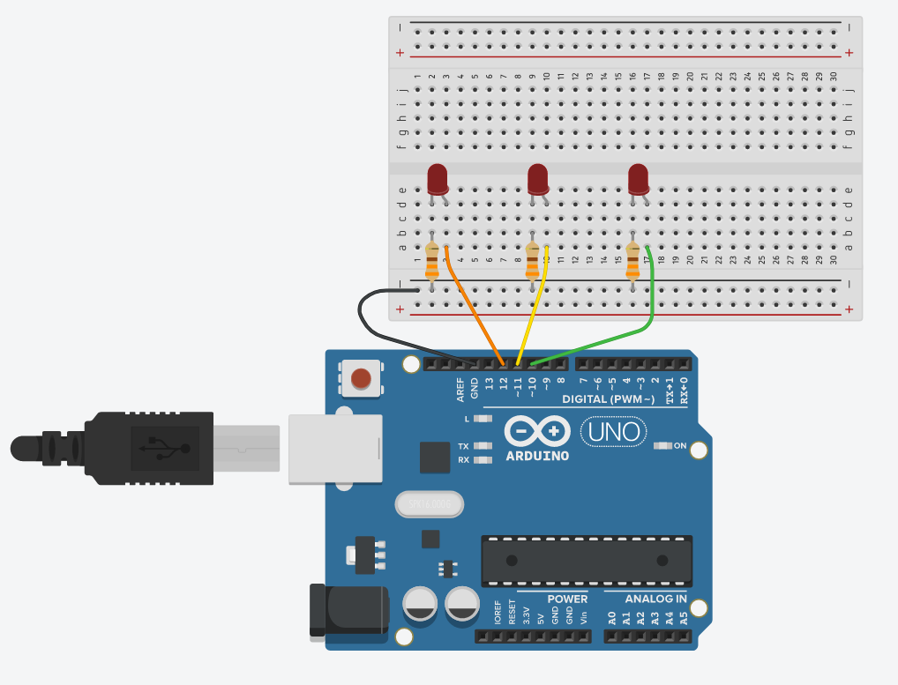

## Introducción al microcontrolador

Al elegir trabajar con un microcontrolador deben tomarse en cuenta las siguientes especificaciones técnicas.

### Pines de propósito general (GPIO)

Son las diferentes entradas y salidas con las que cuenta  el microcontrolador, se emplean para  obtener los valores de diferentes sensores, establecer comunicaciones con otros dispositivos y controlar elementos desde LED hasta motores de gran potencia.  Pueden ser:

- Entradas y salidas digitales
- Entradas analógicas
- Salidas analógicas o PWM
- Puertos de comunicación

Con relación a los pines GPIO se debe considerar el número de cada tipo de pin que se requiere al seleccionar el microcontrolador para que este sea capaz de controlar todos los elementos.

### Voltaje de operación

Indica el tipo de alimentación que debe recibir el microcontrolador y los valores con los que operan sus pines de propósito general. Es importante conocer estos valores ya que de lo contario podrían dañarse componentes o bien no funcionar adecuadamente en caso de no  respetarlos. Los valores más comunes son 3.3V y 5V de modo que si se opera con elementos de mayor consumo de energía se deberán utilizar etapas de potencia para controlar dichos elementos.

### Velocidad de operación

También se conoce como velocidad de reloj y se refiere a la frecuencia o rapidez con la que puede procesar las instrucciones. Se debe tomar en cuenta sobre todo para aplicaciones que requieran alta velocidad de procesamiento. Algunos de los valores más comunes son 16MHz, 80MHz y 120MHz.

### Resolución del convertidor analógico a digital (ADC).

Se refiere a la precisión con la que el ADC entrega el resultado de convertir un valor analógico a su equivalente en digital. Algunos de los valores más comunes de resolución son 8 bits, 10 bits y 12 bits. Una de las mayores razones por las cuales se unen Arduino y Raspberry Pi es precisamente el utilizar sensores que solo entregan salida analógica, siendo convertida en digital para la comunicación con la Raspi, ya que ésta solo admite entrada digital.

### Puertos de comunicación

Se refiere a los pines que sirven para comunicar dos o más dispositivos entre sí, bajo un protocolo de comunicación estandarizado. Los protocolos mayormente empleados son la comunicación serial, I2C y SPI/SSI.

## Arduino

Arduino es una plataforma de electrónica abierta para la creación de prototipos basada en software y hardware libre, flexibles y fáciles de usar. Se creó para artistas, diseñadores, aficionados y cualquier interesado en crear entornos u objetos interactivos.

Arduino puede tomar información del entorno a través de sus pines de entrada, para esto puede ser usada toda una gama de sensores y puede afectar aquello que le rodea controlando luces, motores y otros actuadores. El microcontrolador en la placa Arduino se programa mediante el lenguaje de programación Arduino (basado en Wiring) y el entorno de desarrollo Arduino IDE (basado en Processing). Los proyectos hechos con Arduino pueden ejecutarse sin necesidad de conectarlo a un ordenador, si bien tienen la posibilidad de hacerlo y
comunicar con diferentes tipos de software.

Las placas pueden ser hechas a mano o comprarse montadas de fábrica; el software puede ser descargado de forma gratuita. Los ficheros de diseño de referencia (CAD) están disponibles bajo una licencia abierta, así pues cualquiera es libre de adaptarlos a sus necesidades.

### Recursos de inicio

A continuación les comparto unos enlaces donde podrán obtener ciertas aplicaciones que resultarán de bastante ayuda en el desarrollo con Arduino. 

#### Arduino IDE

El primero es para acceder al entorno de desarrollo propiamente dicho: [Arduino IDE](https://www.arduino.cc/en/Main/Software). En ese sitio podrán encontrar las diferentes opciones existentes: la aplicación web (por si no desean instalar nada) y las versiones de instaladores para todos los sistemas operativos. Cabe mencionar que esta es la aplicación a utilizar si se cuenta con la tarjeta Arduino.

#### Fritzing

Es un programa que permite el diseño de circuitos electrónicos, por lo cual es bastante práctico para dibujar el prototipo del diagramado, ya que cuenta con representaciones de los dispositivos usuales e incluso, tarjetas _protoboard_. Resulta bastante útil si se desea representar y documentar circuitos de prueba reales, ya que incluso permite obtener el diagrama electrónico de los mismos. Puede obtenerse desde su [página de descargas](https://fritzing.org/download/).

*NOTA: Fritzing es software libre y eso no necesariamente implica que sea gratis. Anteriormente la descarga era totalmente libre y gratuita, pero desde la versión 0.9.4 de diciembre de 2019, comenzó a pedir un pago para poder obtenerla. Aún es posible acceder a Fritzing de manera gratuita, pero solo desde los repositorios de alguna distribución Linux.

#### TinkerCAD

Es un sitio web que implementa un simulador de circuitos electrónicos, con la gran ventaja de que incluye a la placa Arduino UNO. Esto permite aprender a construir y programar circuitos electrónicos cuya base sea la placa como tal. Puede accederse por medio del siguiente enlace:

[TinkerCAD](https://www.tinkercad.com)

La interfaz es bastante intuitiva. Baste ver la siguiente captura y unas cuantas anotaciones:


1. Botón de inicio, devuelve al listado de proyectos.

2. Nombre del circuito

3. Con este botón se gira el componente selecciona 45°

4. Centra el circuito en pantalla

5. Elimina el componente seleccionado, lo mismo puede hacerse con la tecla `Supr`

6. Botones deshacer y rehacer

7. Agrega notas al circuito

8. Oculta el elemento seleccionado

9. Pantalla principal de edición

10. Muestra el código. Por defecto lo muestra en modo Bloques, pero puede seleccionarse entre los modos Bloques, Texto o Bloques+Texto

11. Inicia/termina la simulación

12. Filtra el listado de componentes

13. Muestra la vista de Circuito en la pantalla principal

14. Cambia a la vista Lista de componentes del circuito

15. Muestra las opciones de la cuenta de usuario

16. Permite compartir el circuito, ya sea como diagrama, imagen o para edición colaborativa

17. Cambia la manera en la que se visualizan los componentes en el listado

18. Listado de componentes

## Placa Arduino UNO

Existe una cantidad decente de placas Arduino, unas enfocadas al audio, a la industria textil, etcétera. También existe un conjunto de añadidos conocidos como _shields_ que le aportan a la placa capacidades de conexión wifi, ethernet, Bluetooth, GPS, GSM, entre otras. Para comenzar, nos enfocaremos únicamente en la placa UNO.

### Componentes

A continuación se muestran los componentes principales de la placa Arduino UNO:


1. Botón de reinicio (reset)

2. Pines de entrada/salida digitales

3. Conector USB tipo AB

4. ATmega 16U2 encargado de la comunicación con la PC

5. LED naranja conectado al pin13

6. LED TX (Transmisor) y RX (Receptor) de la comunicación serial

7. LED verde de placa encendida

8. Cristal de cuarzo de 16Mhz

9. Regulador de voltaje

10. Microcontrolador ATmega 328, cerebro del Arduino

11. Conector hembra 2.1mm con centro positivo

12. Pines de voltaje y tierra

13. Entradas análogas


## Prácticas con Arduino

### Práctica 01. Encender un LED

Aprenderemos a activar una señal digital, con ella encenderemos un LED, y por medio de un temporizador dejaremos que permanezca así y lo apagaremos al transcurrir un segundo. También veremos una introducción a la estructura de un programa de Arduino.

#### Material

- LED de cualquier color

- Resistencia de mínimo 470$\Omega$

- Arduino UNO

- Cable rojo

- Cable negro

#### Circuito

Armamos el siguiente circuito en formato físico o en TinkerCAD:


#### Código

En la interfaz de TinkerCAD damos clic en el botón `Código` y veremos que nos muestra un conjunto de bloques. En el menú contextual que dice llanamente `Bloques` seleccionamos `Texto`. Hacemos caso omiso de la advertencia que nos marca y veremos que, de no haber editado anteriormente, ya está el siguiente código escrito:

```{C++}
void setup()
{
  pinMode(13, OUTPUT);
}

void loop()
{
  digitalWrite(13, HIGH);
  delay(1000); // Wait for 1000 millisecond(s)
  digitalWrite(13, LOW);
  delay(1000); // Wait for 1000 millisecond(s)
}
```

Damos clic en `Iniciar simulación` y deberíamos poder ver cómo el led enciende y apaga en intervalos de un segundo. Expliquemos el código, mencionando la recomendación de darle una ojeada a los recursos de la Unidad, más precisamente a la que se refiere a la [programación en Arduino](https://luisemendoza.github.io/SE-UPGoP/PA.html). Los comentarios se escriben antecedidos por un par de diagonales `//`.

```{C++}
void setup()   // Esto se ejecutará cada vez que el arduino encienda
{
  pinMode(13, OUTPUT);   // Configuramos el pin 13 como un pin con señal de salida
}

void loop()   // Esto es un ciclo, y se estará ejecutando mientras el arduino tenga energía
{
  digitalWrite(13, HIGH);   // Activamos la señal digital (1) y la mandamos al pin 13, led encendido
  delay(1000);   // mantenemos la señal activa por mil milisegundos (1 segundo)
  digitalWrite(13, LOW);   // Desactivamos la señal digital (0), led apagado
  delay(1000); // mantenemos la señal desactivada por mil milisegundos 
}

// Programa terminado
```

### Ejercicio propuesto 01

Con el mismo circuito, haga que el led se comporte lo más parecido posible a un estrobo. Sugerencia, juegue con los tiempos de encendido y apagado.

### Práctica 02. Encender varios leds

Ahora encenderemos y apagaremos secuencialmente tres leds, cada uno conectado a un pin específico. Por la parte del código, veremos cómo declarar variables y a la vez, asignarlas a su pin pertinente.

#### Material

- 3 leds, color indistinto

- 3 resistencias de al menos 330$\Omega$

- Tablilla de prototipado

- Arduino UNO

#### Circuito

Conectaremos los tres leds tal como sigue. No olvidemos que la patilla corta va hacia tierra y que la resistencia puede unirse indistintivamente a dicha conexión o a voltaje/control.



#### Código

Al inicio de nuestro programa podemos asignar los pines a una variable entera. Las variables se declaran como ```(int)```:

```{C++}
int led1 = 12;
int led2 = 11;
int led3 = 10;
```
 
Configuramos los pines como salidas:

```{C++}
void setup()
{
  pinMode(led1, OUTPUT);
  pinMode(led2, OUTPUT);
  pinMode(led3, OUTPUT);
}
```

Crearemos ahora el programa:

```{C++}
void loop()
{
  digitalWrite(led1, HIGH);
  delay(1000);
  digitalWrite(led1, LOW);
  delay(500);
  digitalWrite(led2, HIGH);
  delay(1000);
  digitalWrite(led2, LOW);
  delay(500);
  digitalWrite(led3, HIGH);
  delay(1000);
  digitalWrite(led3, LOW);
  delay(500);
}
```

A continuación el código completo:

```{C++}
int led1 = 12;
int led2 = 11;
int led3 = 10;

void setup()
{
  pinMode(led1, OUTPUT);
  pinMode(led2, OUTPUT);
  pinMode(led3, OUTPUT);
}

void loop()
{
  digitalWrite(led1, HIGH);
  delay(1000);
  digitalWrite(led1, LOW);
  delay(500);
  digitalWrite(led2, HIGH);
  delay(1000);
  digitalWrite(led2, LOW);
  delay(500);
  digitalWrite(led3, HIGH);
  delay(1000);
  digitalWrite(led3, LOW);
  delay(500);
}
```

### Práctica 02 con un ciclo _for_

Mismo circuito, diferente implementación de código. Haremos uso de un bucle _for_:

#### Código

```{C++}
int leds[3] = {12, 11, 10};

void setup()
{
  int i = 0;
  for (i=0; i<3; i++)
  {
    pinMode(leds[i], OUTPUT);
  }
}

void loop()
{
  int i = 0;
  for(i=0; i<3; i++)
  {
    digitalWrite(leds[i], HIGH);
    delay(500);
    digitalWrite(leds[i], LOW);
    delay(500);
  }
}
```

### Práctica 03. Recibiendo señal de un botón

En esta ocasión leeremos el estado de un botón interruptor y en consecuencia de este, encenderemos (o mantendremos apagado) un led. Hasta este momento solo hemos utilizado la función _digitalWrite()_ para enviar voltaje a través de un pin desde Arduino hasta un led, encendiéndolo. Ahora utilizaremos _digitalRead()_, con la cual leeremos un nivel lógico o cambio de estado en el botón.

_digitalRead()_ es bastante simple: devolverá HIGH o 1, si el voltaje en el pin asociado es alto o existente (tomemos en cuenta que es una lectura digital, por lo cual considera voltajes mayores a 2.5V como un alto lógico); por otro lado, devolverá LOW o 0 en caso contrario.

#### Material

- Led (color indistinto)

- Resistencia de al menos 330$\Omega$

- Resistencia de 1k$\Omega$

- Botón interruptor (switch button) de 4 terminales

- Arduino UNO

#### Circuito _pull-up_

Es muy importante mencionar que al configurar como entrada un pin, este se comportará como una especie de antena y estará leyendo de manera aleatoria valores HIGH o LOW, ya que no es controlado por el circuito. Esto se debe a que al estar en modo entrada, el pin se encuentra en estado de alta impedancia y sus lecturas serán flotantes. Por esta razón debemos agregar una resistencia al circuito (en circuitos comunes, un botón interruptor no la necesitaría), que le brinde una conexión por defecto al interruptor, aunque este se encuentre abierto. Sin embargo, existen dos posibles configuraciones para esto: resistencia pull-up y resistencia pull-down. Comenzaremos con la configuración pull-up:


Podemos distinguir que en este arreglo la resistencia pull-up (notemos que el cable conectado al pin 2 se encuentra entre el botón y el resistor), crea una conexión permanente entre el pin de control y la alimentación. Esto implica que la lectura será HIGH, siempre y cuando el botón no sea presionado. Al momento de accionar el interruptor, la corriente se irá a la conexión a tierra que habilitará dicho botón, por lo que la lectura en el pin 2 ahora será LOW.

###### Código

Con lo anterior expuesto, podemos saber que al utilizar una resistencia pull-up tendremos el equivalente a un botón normalmente cerrado (NC). En consecuencia, nuestro código debe expresarse aproximadamente como sigue, para aprovechar la circunstancia. 

Primero declaremos los pines de acuerdo al componente que les conectaremos:

```{C++}
int boton=2; // Pin del botón
int led=13; // Pin del led
```
 
Ahora configuramos el modo de trabajo de cada pin:

```{C++} 
void setup() // Esto se ejecuta cada que se enciende el arduino
{
  pinMode(boton, INPUT); // configuramos el puerto como entrada
  pinMode(led, OUTPUT); // configuramos el puerto como salida
}
```

Para estar verificando continuamente el estado del botón y realizar alguna acción si este cambia, utilizaremos la sentencia condicional _if_. Para esta práctica, encenderemos un led cuando el botón sea presionado, lo que implica que la condición es que el estado del interruptor sea LOW, debido a que la resistencia pull-up le da un estado HIGH por defecto.

```{C++}
void loop() 
{
  if (digitalRead(boton) == LOW) //con resistencia pull-up LOW significa que el botón ha sido presionado
  {
    digitalWrite(led, HIGH); //encendemos el led si detectamos el cambio de estado del interruptor
  }
  else //si el estado no cambia, entonces:
  {
    digitalWrite(led, LOW); //el led continúa apagado
  }
}
```

##### Resistencia _pull-down_


Aquí podemos notar que la conexión permanente es del pin 2 con tierra, por lo que dicho pin estará leyendo un LOW por defecto. Así, cuando el botón sea presionado, la corriente que viene de los 5V de alimentación se irán hacia el pin 2, cambiando el estado a HIGH. Tenemos entonces el comportamiento de un botón normalmente abierto (NA).

###### Código

Prácticamente el mismo, solo con un ligero cambio:

```{C++}
// Declaramos los puertos de entrada y salida

int boton=2; // Pin del botón
int led=13; // Pin del led
 
// Función principal

void setup() // Esto se ejecuta cada que se enciende el arduino
{
  pinMode(boton, INPUT); // configuramos el puerto como entrada
  pinMode(led, OUTPUT); // configuramos el puerto como salida
}

// Función a repetir

void loop() // Esto se ejecuta siempre que se esté encendido
{
  if (digitalRead(boton) == HIGH) // con resistencia pull-down el estado del botón presionado es HIGH
  {
    digitalWrite(led, HIGH);
  }
  else
  {
    digitalWrite(led, LOW);
  }
}
      
// Termina el programa

```

### Práctica 04. Lectura serial de una entrada digital

Reutilizaremos uno de los circuitos con un botón interruptor (arreglo pull-down), con la posibilidad de prescindir del led, pues los cambios en el estado del botón los podremos identificar mediante la salida en la consola serial (ya sea en el monitor de Tinkercad o en la pantalla de la computadora por medio del IDE de Arduino). 

#### Material

- Led (color indistinto)

- Resistencia de al menos 330$\Omega$

- Resistencia de 1k$\Omega$

- Botón interruptor (switch button) de 4 terminales

- Arduino UNO

#### Código

La secuencia de declaraciones y configuraciones que ya conocemos, con excepción de una línea nueva:

```{C++}
int boton=2;
int led=13;

void setup() 
{
  pinMode(boton,INPUT); 
  pinMode(led, OUTPUT);
  Serial.begin(9600); //Inicia la comunicación serial en el puerto 9600
}
```

Para el ciclo utilizaremos lo siguiente:

1. Una variable entera para guardar en ella el estado del botón (0 o 1).

2. Una función nueva, _Serial.println("Texto a imprimir")_, la cual imprime en la consola serial.

```{C++}
void loop() 
{
  int estado = digitalRead(boton); 
  if (estado==1) // el 1 indica que el botón ha sido presionado
  {
    Serial.println("Presionado");
    digitalWrite(led, HIGH); 
  }
  else
  {
    Serial.println("No presionado");
    digitalWrite(led, LOW);
  }
  delay(100); //Retardo para la correcta visualización en la consola
}
```


