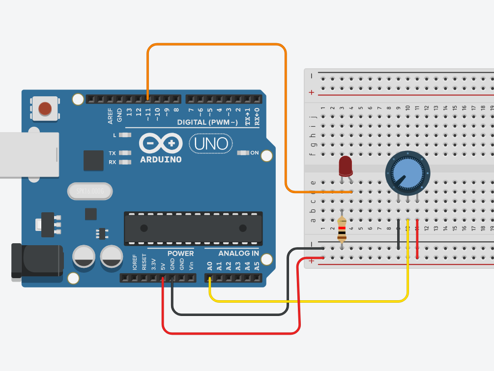
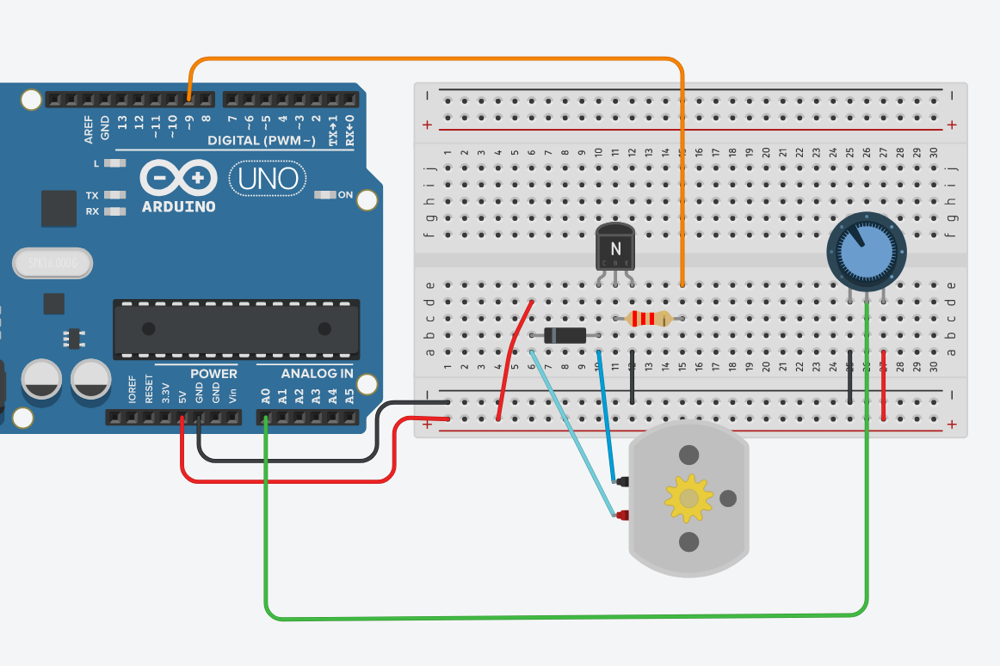

## Introducción al microcontrolador

Al elegir trabajar con un microcontrolador deben tomarse en cuenta las siguientes especificaciones técnicas.

### Pines de propósito general (GPIO)

Son las diferentes entradas y salidas con las que cuenta  el microcontrolador, se emplean para  obtener los valores de diferentes sensores, establecer comunicaciones con otros dispositivos y controlar elementos desde LED hasta motores de gran potencia.  Pueden ser:

- Entradas y salidas digitales
- Entradas analógicas
- Salidas analógicas o PWM
- Puertos de comunicación

Con relación a los pines GPIO se debe considerar el número de cada tipo de pin que se requiere al seleccionar el microcontrolador para que este sea capaz de controlar todos los elementos.

### Voltaje de operación

Indica el tipo de alimentación que debe recibir el microcontrolador y los valores con los que operan sus pines de propósito general. Es importante conocer estos valores ya que de lo contario podrían dañarse componentes o bien no funcionar adecuadamente en caso de no  respetarlos. Los valores más comunes son 3.3V y 5V de modo que si se opera con elementos de mayor consumo de energía se deberán utilizar etapas de potencia para controlar dichos elementos.

### Velocidad de operación

También se conoce como velocidad de reloj y se refiere a la frecuencia o rapidez con la que puede procesar las instrucciones. Se debe tomar en cuenta sobre todo para aplicaciones que requieran alta velocidad de procesamiento. Algunos de los valores más comunes son 16MHz, 80MHz y 120MHz.

### Resolución del convertidor analógico a digital (ADC).

Se refiere a la precisión con la que el ADC entrega el resultado de convertir un valor analógico a su equivalente en digital. Algunos de los valores más comunes de resolución son 8 bits, 10 bits y 12 bits. Una de las mayores razones por las cuales se unen Arduino y Raspberry Pi es precisamente el utilizar sensores que solo entregan salida analógica, siendo convertida en digital para la comunicación con la Raspi, ya que ésta solo admite entrada digital.

### Puertos de comunicación

Se refiere a los pines que sirven para comunicar dos o más dispositivos entre sí, bajo un protocolo de comunicación estandarizado. Los protocolos mayormente empleados son la comunicación serial, I2C y SPI/SSI.

## Arduino

Arduino es una plataforma de electrónica abierta para la creación de prototipos basada en software y hardware libre, flexibles y fáciles de usar. Se creó para artistas, diseñadores, aficionados y cualquier interesado en crear entornos u objetos interactivos.

Arduino puede tomar información del entorno a través de sus pines de entrada, para esto puede ser usada toda una gama de sensores y puede afectar aquello que le rodea controlando luces, motores y otros actuadores. El microcontrolador en la placa Arduino se programa mediante el lenguaje de programación Arduino (basado en Wiring) y el entorno de desarrollo Arduino IDE (basado en Processing). Los proyectos hechos con Arduino pueden ejecutarse sin necesidad de conectarlo a un ordenador, si bien tienen la posibilidad de hacerlo y
comunicar con diferentes tipos de software.

Las placas pueden ser hechas a mano o comprarse montadas de fábrica; el software puede ser descargado de forma gratuita. Los ficheros de diseño de referencia (CAD) están disponibles bajo una licencia abierta, así pues cualquiera es libre de adaptarlos a sus necesidades.

### Recursos de inicio

A continuación les comparto unos enlaces donde podrán obtener ciertas aplicaciones que resultarán de bastante ayuda en el desarrollo con Arduino. 

#### Arduino IDE

El primero es para acceder al entorno de desarrollo propiamente dicho: [Arduino IDE](https://www.arduino.cc/en/Main/Software). En ese sitio podrán encontrar las diferentes opciones existentes: la aplicación web (por si no desean instalar nada) y las versiones de instaladores para todos los sistemas operativos. Cabe mencionar que esta es la aplicación a utilizar si se cuenta con la tarjeta Arduino.

#### Fritzing

Es un programa que permite el diseño de circuitos electrónicos, por lo cual es bastante práctico para dibujar el prototipo del diagramado, ya que cuenta con representaciones de los dispositivos usuales e incluso, tarjetas _protoboard_. Resulta bastante útil si se desea representar y documentar circuitos de prueba reales, ya que incluso permite obtener el diagrama electrónico de los mismos. Puede obtenerse desde su [página de descargas](https://fritzing.org/download/).

*NOTA: Fritzing es software libre y eso no necesariamente implica que sea gratis. Anteriormente la descarga era totalmente libre y gratuita, pero desde la versión 0.9.4 de diciembre de 2019, comenzó a pedir un pago para poder obtenerla. Aún es posible acceder a Fritzing de manera gratuita, pero solo desde los repositorios de alguna distribución Linux.

#### TinkerCAD

Es un sitio web que implementa un simulador de circuitos electrónicos, con la gran ventaja de que incluye a la placa Arduino UNO. Esto permite aprender a construir y programar circuitos electrónicos cuya base sea la placa como tal. Puede accederse por medio del siguiente enlace:

[TinkerCAD](https://www.tinkercad.com)

La interfaz es bastante intuitiva. Baste ver la siguiente captura y unas cuantas anotaciones:


1. Botón de inicio, devuelve al listado de proyectos.

2. Nombre del circuito

3. Con este botón se gira el componente selecciona 45°

4. Centra el circuito en pantalla

5. Elimina el componente seleccionado, lo mismo puede hacerse con la tecla `Supr`

6. Botones deshacer y rehacer

7. Agrega notas al circuito

8. Oculta el elemento seleccionado

9. Pantalla principal de edición

10. Muestra el código. Por defecto lo muestra en modo Bloques, pero puede seleccionarse entre los modos Bloques, Texto o Bloques+Texto

11. Inicia/termina la simulación

12. Filtra el listado de componentes

13. Muestra la vista de Circuito en la pantalla principal

14. Cambia a la vista Lista de componentes del circuito

15. Muestra las opciones de la cuenta de usuario

16. Permite compartir el circuito, ya sea como diagrama, imagen o para edición colaborativa

17. Cambia la manera en la que se visualizan los componentes en el listado

18. Listado de componentes

## Placa Arduino UNO

Existe una cantidad decente de placas Arduino, unas enfocadas al audio, a la industria textil, etcétera. También existe un conjunto de añadidos conocidos como _shields_ que le aportan a la placa capacidades de conexión wifi, ethernet, Bluetooth, GPS, GSM, entre otras. Para comenzar, nos enfocaremos únicamente en la placa UNO.

### Componentes

A continuación se muestran los componentes principales de la placa Arduino UNO:


1. Botón de reinicio (reset)

2. Pines de entrada/salida digitales

3. Conector USB tipo AB

4. ATmega 16U2 encargado de la comunicación con la PC

5. LED naranja conectado al pin13

6. LED TX (Transmisor) y RX (Receptor) de la comunicación serial

7. LED verde de placa encendida

8. Cristal de cuarzo de 16Mhz

9. Regulador de voltaje

10. Microcontrolador ATmega 328, cerebro del Arduino

11. Conector hembra 2.1mm con centro positivo

12. Pines de voltaje y tierra

13. Entradas análogas


## Prácticas con Arduino

### Práctica 01. Encender un LED

Aprenderemos a activar una señal digital, con ella encenderemos un LED, y por medio de un temporizador dejaremos que permanezca así y lo apagaremos al transcurrir un segundo. También veremos una introducción a la estructura de un programa de Arduino.

#### Material

- LED de cualquier color

- Resistencia de mínimo 470$\Omega$

- Arduino UNO

- Cable rojo

- Cable negro

#### Circuito

Armamos el siguiente circuito en formato físico o en TinkerCAD:


#### Código

En la interfaz de TinkerCAD damos clic en el botón `Código` y veremos que nos muestra un conjunto de bloques. En el menú contextual que dice llanamente `Bloques` seleccionamos `Texto`. Hacemos caso omiso de la advertencia que nos marca y veremos que, de no haber editado anteriormente, ya está el siguiente código escrito:

```{C++}
void setup()
{
  pinMode(13, OUTPUT);
}

void loop()
{
  digitalWrite(13, HIGH);
  delay(1000); // Wait for 1000 millisecond(s)
  digitalWrite(13, LOW);
  delay(1000); // Wait for 1000 millisecond(s)
}
```

Damos clic en `Iniciar simulación` y deberíamos poder ver cómo el led enciende y apaga en intervalos de un segundo. Expliquemos el código, mencionando la recomendación de darle una ojeada a los recursos de la Unidad, más precisamente a la que se refiere a la [programación en Arduino](https://luisemendoza.github.io/SE-UPGoP/PA.html). Los comentarios se escriben antecedidos por un par de diagonales `//`.

```{C++}
void setup()   // Esto se ejecutará cada vez que el arduino encienda
{
  pinMode(13, OUTPUT);   // Configuramos el pin 13 como un pin con señal de salida
}

void loop()   // Esto es un ciclo, y se estará ejecutando mientras el arduino tenga energía
{
  digitalWrite(13, HIGH);   // Activamos la señal digital (1) y la mandamos al pin 13, led encendido
  delay(1000);   // mantenemos la señal activa por mil milisegundos (1 segundo)
  digitalWrite(13, LOW);   // Desactivamos la señal digital (0), led apagado
  delay(1000); // mantenemos la señal desactivada por mil milisegundos 
}

// Programa terminado
```

### Ejercicio propuesto 01

Con el mismo circuito, haga que el led se comporte lo más parecido posible a un estrobo. Sugerencia, juegue con los tiempos de encendido y apagado.

### Práctica 02. Encender varios leds

Ahora encenderemos y apagaremos secuencialmente tres leds, cada uno conectado a un pin específico. Por la parte del código, veremos cómo declarar variables y a la vez, asignarlas a su pin pertinente.

#### Material

- 3 leds, color indistinto

- 3 resistencias de al menos 330$\Omega$

- Tablilla de prototipado

- Arduino UNO

#### Circuito

Conectaremos los tres leds tal como sigue. No olvidemos que la patilla corta va hacia tierra y que la resistencia puede unirse indistintivamente a dicha conexión o a voltaje/control.


#### Código

Al inicio de nuestro programa podemos asignar los pines a una variable entera. Las variables se declaran como ```(int)```:

```{C++}
int led1 = 12;
int led2 = 11;
int led3 = 10;
```
 
Configuramos los pines como salidas:

```{C++}
void setup()
{
  pinMode(led1, OUTPUT);
  pinMode(led2, OUTPUT);
  pinMode(led3, OUTPUT);
}
```

Crearemos ahora el programa:

```{C++}
void loop()
{
  digitalWrite(led1, HIGH);
  delay(1000);
  digitalWrite(led1, LOW);
  delay(500);
  digitalWrite(led2, HIGH);
  delay(1000);
  digitalWrite(led2, LOW);
  delay(500);
  digitalWrite(led3, HIGH);
  delay(1000);
  digitalWrite(led3, LOW);
  delay(500);
}
```

A continuación el código completo:

```{C++}
int led1 = 12;
int led2 = 11;
int led3 = 10;

void setup()
{
  pinMode(led1, OUTPUT);
  pinMode(led2, OUTPUT);
  pinMode(led3, OUTPUT);
}

void loop()
{
  digitalWrite(led1, HIGH);
  delay(1000);
  digitalWrite(led1, LOW);
  delay(500);
  digitalWrite(led2, HIGH);
  delay(1000);
  digitalWrite(led2, LOW);
  delay(500);
  digitalWrite(led3, HIGH);
  delay(1000);
  digitalWrite(led3, LOW);
  delay(500);
}
```

### Práctica 02 con un ciclo _for_

Mismo circuito, diferente implementación de código. Haremos uso de un bucle _for_:

#### Código

```{C++}
int leds[3] = {12, 11, 10};

void setup()
{
  int i = 0;
  for (i=0; i<3; i++)
  {
    pinMode(leds[i], OUTPUT);
  }
}

void loop()
{
  int i = 0;
  for(i=0; i<3; i++)
  {
    digitalWrite(leds[i], HIGH);
    delay(500);
    digitalWrite(leds[i], LOW);
    delay(500);
  }
}
```

### Práctica 03. Recibiendo señal de un botón

En esta ocasión leeremos el estado de un botón interruptor y en consecuencia de este, encenderemos (o mantendremos apagado) un led. Hasta este momento solo hemos utilizado la función _digitalWrite()_ para enviar voltaje a través de un pin desde Arduino hasta un led, encendiéndolo. Ahora utilizaremos _digitalRead()_, con la cual leeremos un nivel lógico o cambio de estado en el botón.

_digitalRead()_ es bastante simple: devolverá HIGH o 1, si el voltaje en el pin asociado es alto o existente (tomemos en cuenta que es una lectura digital, por lo cual considera voltajes mayores a 2.5V como un alto lógico); por otro lado, devolverá LOW o 0 en caso contrario.

#### Material

- Led (color indistinto)

- Resistencia de al menos 330$\Omega$

- Resistencia de 1k$\Omega$

- Botón interruptor (switch button) de 4 terminales

- Arduino UNO

#### Circuito _pull-up_

Es muy importante mencionar que al configurar como entrada un pin, este se comportará como una especie de antena y estará leyendo de manera aleatoria valores HIGH o LOW, ya que no es controlado por el circuito. Esto se debe a que al estar en modo entrada, el pin se encuentra en estado de alta impedancia y sus lecturas serán flotantes. Por esta razón debemos agregar una resistencia al circuito (en circuitos comunes, un botón interruptor no la necesitaría), que le brinde una conexión por defecto al interruptor, aunque este se encuentre abierto. Sin embargo, existen dos posibles configuraciones para esto: resistencia pull-up y resistencia pull-down. Comenzaremos con la configuración pull-up:


Podemos distinguir que en este arreglo la resistencia pull-up (notemos que el cable conectado al pin 2 se encuentra entre el botón y el resistor), crea una conexión permanente entre el pin de control y la alimentación. Esto implica que la lectura será HIGH, siempre y cuando el botón no sea presionado. Al momento de accionar el interruptor, la corriente se irá a la conexión a tierra que habilitará dicho botón, por lo que la lectura en el pin 2 ahora será LOW.

###### Código

Con lo anterior expuesto, podemos saber que al utilizar una resistencia pull-up tendremos el equivalente a un botón normalmente cerrado (NC). En consecuencia, nuestro código debe expresarse aproximadamente como sigue, para aprovechar la circunstancia. 

Primero declaremos los pines de acuerdo al componente que les conectaremos:

```{C++}
int boton=2; // Pin del botón
int led=13; // Pin del led
```
 
Ahora configuramos el modo de trabajo de cada pin:

```{C++} 
void setup() // Esto se ejecuta cada que se enciende el arduino
{
  pinMode(boton, INPUT); // configuramos el puerto como entrada
  pinMode(led, OUTPUT); // configuramos el puerto como salida
}
```

Para estar verificando continuamente el estado del botón y realizar alguna acción si este cambia, utilizaremos la sentencia condicional _if_. Para esta práctica, encenderemos un led cuando el botón sea presionado, lo que implica que la condición es que el estado del interruptor sea LOW, debido a que la resistencia pull-up le da un estado HIGH por defecto.

```{C++}
void loop() 
{
  if (digitalRead(boton) == LOW) //con resistencia pull-up LOW significa que el botón ha sido presionado
  {
    digitalWrite(led, HIGH); //encendemos el led si detectamos el cambio de estado del interruptor
  }
  else //si el estado no cambia, entonces:
  {
    digitalWrite(led, LOW); //el led continúa apagado
  }
}
```

##### Resistencia _pull-down_


Aquí podemos notar que la conexión permanente es del pin 2 con tierra, por lo que dicho pin estará leyendo un LOW por defecto. Así, cuando el botón sea presionado, la corriente que viene de los 5V de alimentación se irán hacia el pin 2, cambiando el estado a HIGH. Tenemos entonces el comportamiento de un botón normalmente abierto (NA).

###### Código

Prácticamente el mismo, solo con un ligero cambio:

```{C++}
// Declaramos los puertos de entrada y salida

int boton=2; // Pin del botón
int led=13; // Pin del led
 
// Función principal

void setup() // Esto se ejecuta cada que se enciende el arduino
{
  pinMode(boton, INPUT); // configuramos el puerto como entrada
  pinMode(led, OUTPUT); // configuramos el puerto como salida
}

// Función a repetir

void loop() // Esto se ejecuta siempre que se esté encendido
{
  if (digitalRead(boton) == HIGH) // con resistencia pull-down el estado del botón presionado es HIGH
  {
    digitalWrite(led, HIGH);
  }
  else
  {
    digitalWrite(led, LOW);
  }
}
      
// Termina el programa

```

### Práctica 04. Lectura serial de una entrada digital

Reutilizaremos uno de los circuitos con un botón interruptor (arreglo pull-down), con la posibilidad de prescindir del led, pues los cambios en el estado del botón los podremos identificar mediante la salida en la consola serial (ya sea en el monitor de Tinkercad o en la pantalla de la computadora por medio del IDE de Arduino). 

#### Material

- Led (color indistinto)

- Resistencia de al menos 330$\Omega$

- Resistencia de 1k$\Omega$

- Botón interruptor (switch button) de 4 terminales

- Arduino UNO

#### Código

La secuencia de declaraciones y configuraciones que ya conocemos, con excepción de una línea nueva:

```{C++}
int boton=2;
int led=13;

void setup() 
{
  pinMode(boton,INPUT); 
  pinMode(led, OUTPUT);
  Serial.begin(9600); //Inicia la comunicación serial en el puerto 9600
}
```

Para el ciclo utilizaremos lo siguiente:

1. Una variable entera para guardar en ella el estado del botón (0 o 1).

2. Una función nueva, _Serial.println("Texto a imprimir")_, la cual imprime en la consola serial.

```{C++}
void loop() 
{
  int estado = digitalRead(boton); 
  if (estado==1) // el 1 indica que el botón ha sido presionado
  {
    Serial.println("Presionado");
    digitalWrite(led, HIGH); 
  }
  else
  {
    Serial.println("No presionado");
    digitalWrite(led, LOW);
  }
  delay(100); //Retardo para la correcta visualización en la consola
}
```

El estado del botón debería estar mostrándose en el monitor serial y cambiar al ser presionado.

### Práctica 05. Introduciendo datos en la consola serial

Ya hemos visto cómo disparar eventos mediante un botón y también cómo leer el estado de dicho componente en la consola serial. Ahora utilizaremos la consola para leer un caracter introducido por el usuario, con la finalidad de disparar un evento dependiendo de cuál caracter se ha introducido. Específicamente hablando, encenderemos un led al introducir un '1' en la consola, apagándolo si introducimos un '0'.

#### Material

- Led de color indistinto

- Resistencia de 220$\Omega$

- Arduino UNO

#### Circuito

De lo más sencillo que hemos realizado, ya que solo estaremos encendiendo/apagando el led: 


#### Código

Agregaremos expresiones no utilizadas anteriormente, como la declaración de dos variables, una tipo _char_, la cual almacenará el último caracter introducido en la consola serial (el tipo _char_ solo almacena un caracter ASCII a la vez), y otra tipo _boolean_ donde estaremos almacenando el estado del led (si se encuentra encendido sera _true_, apagado será _false_):

```{C++}
int led = 13; //Pin donde se encuentra el led, salida
char lectura; //Variable donde se almacena la letra
boolean encendido = false; //Estado del led la primera vez, apagado por defecto
```

En la configuración abrimos la comunicación serial a la vez que configuramos el pin 13 como salida:

```{C++}
void setup() 
{
  Serial.begin(9600); //Inicia comunicación serial
  pinMode(led, OUTPUT); 
}
```

Ya en la función principal haremos la lectura de la consola serial y guardaremos su valor en la variable tipo _char_ que ya declaramos. Así, si el valor introducido es un '1' y el led está apagado, lo encendemos y guardamos su estado. Por lo contrario, si se introduce un '0' y el led está encendido, lo apagamos y también actualizamos su estado. Esto lo conseguiremos con un condicional _if_ que incluya el operador _and_ para que considere el cumplimiento de ambas condiciones a la vez:

```{C++}
void loop()
{
  lectura=Serial.read();
  if ( (lectura == '1') && (encendido == false) ) // Si es '1' y además el led está apagado
  {
    digitalWrite(led, HIGH); // Encendemos el led
    encendido = true; // Actualizamos el estado del led
  }
  else if ( (lectura == '0') && (encendido == true) ) // Si es '0' y además el led está encendido
  {
    digitalWrite(led, LOW); // Apagamos el led
    encendido = false; // Actualizamos el estado del led
  }
}
```

### Práctica 06. Encender gradualmente un led

Hasta el momento no hemos utilizado la funcionalidad PWM, la cual nos permite dar una salida análoga para el control de ciertos componentes. Este tipo de salida resulta muy útil cuando queramos que un componente tenga un comportamiento cambiante más allá de lo que una salida digital brinda: solo encender y apagar. En nuestro caso, comenzaremos por darle a un led un incremento gradual en su brillo, utilizando uno de los tantos pines PWM del arduino. Estos últimos los podemos identificar por medio de la virgulilla (~) que acompaña al número de pin.

#### Material

- Led de color indistinto, rojo de preferencia

- Resistencia de al menos 220$\Omega$

- Arduino UNO

#### Circuito

Es un arreglo muy sencillo, ya quie consiste solo de un led y una resistencia. Sin embargo, no conectaremos el led al mismo pin 13 de siempre, ya que necesitamos un pin con salida análoga. Usaremos para este caso el pin 9:


#### Código

Declararemos una variable que represente al brillo actual del led, el cual debe arrancar en cero. A la vez introduciremos una variable que represente al incremento gradual del brillo, en este caso será de 5 en 5:

```{C++}
int brillo = 0;
int variacion = 5;
int led = 9; 
```

Configuramos el único pin utilizado como salida:

```{C++}
void setup () 
{
  pinMode(led, OUTPUT); 
}
```

Utilizaremos la función _analogWrite_ en lugar de la habitual _digitalWrite_ para encender proporcionalmente al led. Notemos que la primera tiene como segundo argumento un valor que no necesariamente se corresponde con LOW o HIGH. Este puede ser cualquier valor entre 0 y 255. En nuestro caso, comenzará como 0, ya que usaremos la variable _brillo_ declarada anteriormente. Para conseguir que en cada vuelta del ciclo el brillo aumente, agregamos una línea que incrementa el valor de _brillo_ sumándole el valor de la variable _variacion_: 5 cada vez. Luego, recordando que los valores mínimo y máximo de una salida PWM son 0 y 255, respectivamente, procedemos a introducir una condición a cumplir. Si el led se encuentra totalmente encendido o totalmente apagado cambiamos el signo de la variable _variacion_ para invertir el sentido del incremento. 

Por ejemplo, al inicio el led arranca totalmente apagado, pero obtiene casi de inmediato un incremento de 5 (debido a la segunda línea del ciclo _loop_), por lo que irá incrementando de 5 en 5 hasta que llegue a 255: brillo pleno. En este punto cambiamos el signo de _variacion_ que entonces se comportará como decremento ya que se estará restando al valor actual de _brillo_, hasta que llegue a 0. En este punto, totalmente apagado, volvemos a cambiar el signo de _variacion_, volviéndose positiva e implicar de nuevo un incremento al estarse sumando a _brillo_:

```{C++}
void loop ()
{
  analogWrite(led, brillo); // Escritura análoga (PWM) en el led, se escribe el valor actual de brillo
  brillo = brillo + variacion; // Incrementamos la variable brillo de 5 en 5
  if (brillo == 0 || brillo == 255)
    variacion = -variacion; //La variación cambia de sentido
    delay (30); //Tiempo de incremento en el brillo
}
```

### Práctica 07. Introduciendo un potenciómetro

Un potenciómetro es una resistencia variable, cuya variación es controlada por medio de una perilla. Esta última aumenta la resistencia conforme se mueva hacia la izquierda, haciendo lo contrario en la dirección opuesta. Como puede intuirse, un potenciómetro (o pot, como tradicionalmente se le llama para abrebiar), es un componente análogo, por lo cual debe ser conectado a un pin que admita este tipo de entrada. Para esta práctica leeremos el valor de la resistencia del pot y lo mostraremos en la consola serial.

#### Material

- Potenciómetro de 10k$\Omega$

- Arduino UNO

#### Circuito

Conectaremos el pot de la siguiente manera. Notemos que la alimentación de 5V se conecta a la tercera terminal, mientras que la tierra se une a la primera patilla. La señal del pot se corresponde con la terminal de enmedio, y la conectamos al pin analógico A0.


#### Código

No declararemos ninguna variable al inicio del código, lo haremos justo en el ciclo de trabajo. Abrimos la comunicación serial a 9600 en la configuración y pasamos al ciclo. En el ciclo declaramos la variable donde almacenaremos la lectura en el pin analógico, imprimimos dicho valor en la consola y colocamos un retraso en la visualización de los datos.

```{C++}
void setup()
{
  Serial.begin(9600);
}

void loop() 
{
  int valor= analogRead(A0);
  Serial.println(valor);
  delay(100);
}
```


### Práctica 08. Encendiendo un led con el pot

El circuito anterior resultó ser bastante sencillo, pues solo necesitamos el pot y la placa para hacerlo funcionar. Ahora veremos como encender un led, dependiendo de la lectura de la posición que tenga la perilla del pot. No olvidemos que esta lectura se encuentra entre 0 y 1023. Como puede observarse, el led seguirá comportándose como un componente digital, por ende, solo encenderá y apagará. 

#### Material

- Potenciómetro de 10k$\Omega$

- Led de cualquier color

- Resistencia de 220$\Omega$

- Arduino UNO

- Tablilla de prototipado

#### Circuito

A partir de ahora haremos uso extensivo de la tablilla de prototipado, para mantener cierta organización coherente de los diferentes dispositivos conectados. La disposición de las terminales del potenciómetro es la misma que en el circuito anterior, solo que ahora la conectamos mediante la tablilla. Agregamos el led y su resistencia, respetando la polaridad de este:


#### Código

Comenzamos declarando el pin conectado al led y configurándolo como salida en el _setup()_, además de abrir allí mismo la comunicaci+on serial:

```{C++}
int led = 13;

void setup() 
{
  Serial.begin(9600); 
  pinMode(led, OUTPUT);
}
```

Enseguida pasamos a construir el ciclo de trabajo. Este consistirá de los siguientes pasos: 

1. Obtener la lectura en el pin A0 y asignarla a una variable (le llamaremos valor); 

2. Imprimir dicha variable en la consola serial; 

3. Introducir una condición: si la perilla se encuentra en la mitad derecha de su giro total, el led encenderá. En caso contrario, se apagará.

4. Ponemos un retraso para la visualización de los datos en la consola.

```{C++}
void loop()
{
  int valor = analogRead(A0); 
  Serial.println(valor); 
  if (valor >= 511) 
  {
    digitalWrite(led,HIGH); 
  }
  else 
  {
    digitalWrite(led,LOW); 
  }
delay(100);
}
```

Sabemos que todo el giro de la perilla se corresponde con un espectro de valores de entrada analógica que va desde 0 hasta 1023. Por lo tanto, la mitad de dicho giro se encuentra en el 511. Colocamos este valor en la condicional para obligar al cambio de estado del led justo cuando la perilla alcance la mitad del giro total. El código completo se muestra a continuación:

```{C++}
int led = 13;

void setup() 
{
  Serial.begin(9600); 
  pinMode(led, OUTPUT);
}

void loop()
{
  int valor = analogRead(A0); //Guardar el valor de la lectura análoga
  Serial.println(valor); //Imprime el valor por la consola
  if (valor >= 500) //Si el valor es mayor o igual a 500
  {
    digitalWrite(led,HIGH); //Enciende el LED en el pin 13
  }
  else //Si el valor es menor a 500
  {
    digitalWrite(led,LOW); //Apaga el LED en el pin 13
  }
delay(100); //Retardo de 100ms para ver los datos de la consola
}
```

### Práctica 09. Encendido gradual de un led con el giro de un pot

Encender un led dependiendo de la posición de la perilla de un pot no resulta ser demasiado práctico. En todo caso no estaríamos utilizando el potenciómetro como se debe, ya que esta tarea la puede realizar también un simple botón interruptor. Resulta pues, más adecuado variar el brillo del led de manera proporcional al giro de la perilla del pot. Eso es lo que implementaremos ahora. Necesitaremos:

#### Material

- Potenciómetro de 10k$\Omega$

- Led de cualquier color

- Resistencia de 220$\Omega$

- Arduino UNO

- Tablilla de prototipado

#### Circuito

Prácticamente el mismo que el anterior, con la única diferencia de que cambiaremos el pin donde conectamos el led. En este caso, queremos utilizar una salida analógica, por ello haremos uso del pin 11 (PWM):



#### Código

Debemos declarar más variables que en la práctica anterior: una primera para el pin del led, una segunda para el pin del pot, una tercera para almacenar el valor de la lectura del pot y una última para almacenar el valor a enviar al led (estas dos pultimas incializadas en 0). ¿Por qué no simplemente mandamos la señal de la lectura del pot directamente al led? Porque necesitamos «convertirla» de manera proporcional. Recordemos que las lecturas análogas van desde 0 hasta 1023, pero las salidas análogas tienen un espectro más reducido: de 0 a 255. Para convertirla, pasaremos el valor de la señal del pot a través de la función _map_, la cual hará la conversión pertinente.

```{C++}
int pot = A0; 
int led = 11; 
int ValorPot = 0;
int ValorLed = 0;
```

Abrimos la comunicación serial:

```{C++}
void setup() 
{
  Serial.begin(9600); 
}
```

Y ahora pasamos al ciclo de trabajo. Asignamos la lectura análoga del pot a la variable destinada (_ValorPot_), luego la mapeamos para hacerla proporcional al rango de valores de salida analógica. Obeservemos los argumentos a dar a la función _map_: _map(variable_a_mapear, valor_a_mapear_inicial, valor_a_mapear_final, valor_mapeado_inicial, valor_mapeado_final)_.

Asignamos el resultado de este mapeado en la variable correspondiente (_ValorLed_) y la escribimos en el pin del led. Hasta ahí ya tenemos todo lo necesario para encender el led de manera gradual. Lo siguiente es solamente para poder mostrar los valores de ambas variables mediante texto más o menos formateado en la consola serial.

```{C++}
void loop() 
{
  ValorPot = analogRead(pot);
  ValorLed = map(ValorPot, 0, 1023, 0, 255);
  analogWrite(led, ValorLed); 
  Serial.print("Valor del sensor = " ); // imprimimos esta frase en la consola
  Serial.print(ValorPot); // imprimimos justo enseguida el valor de la señal del pot
  Serial.print("\t Intensidad de brillo = "); // otra frase, ahora con tabulación
  Serial.println(ValorLed); // imprimimos el valor de salida, cerrando línea y pasando a otra
  delay(2); // esperamos dos milisegundos para dar tiempo a la correcta conversión
}
```

A continuación el código completo:

```{C++}
const int pot = A0;
const int led = 11;
int ValorPot = 0; 
int ValorLed = 0; 

void setup() 
{
  Serial.begin(9600);
}

void loop() 
{
  ValorPot = analogRead(pot);
  ValorLed = map(ValorPot, 0, 1023, 0, 255);
  analogWrite(led, ValorLed);
  Serial.print("Valor del sensor = " ); 
  Serial.print(ValorPot);
  Serial.print("\t Intensidad de brillo = ");
  Serial.println(ValorLed);
  delay(2);
}
```

### Práctica 10. Encendiendo un motor CD

Los motores eléctricos son dispositivos que transforman la energía eléctrica en movimiento, gracias a ciertos fenómenos electromagnéticos. Existen varios tipos de motor eléctrico que podemos dividir en dos categorías muy notorias, basados en el tipo de corriente que los energiza: corriente alterna y corriente directa. Nos enfocaremos en los últimos. Estos son relativamente fáciles de controlar en cuanto a su velocidad y sentido del giro: variando el voltaje para lo primero, invirtiendo la polaridad para lo segundo.

Sin embargo, es importante mencionar que un motor eléctrico es también un dispositivo reversible: si se alimenta con energía eléctrica en sus terminales produce movimiento en un eje, pero si ese eje se mueve por medios externos entonces generará una corriente eléctrica en esas mismas terminales.

#### Materiales

- Transistor NPN (BJT)

- Resistencia de 2.2 k$\Omega$

- Diodo

- Motor de corriente directa o continua

- Tablilla de prototipado

- Arduino UNO

#### Circuito

No podemos simplemente conectar el motor al arduino por dos razones importantes: un motor es un componente que requiere bastante energía y el hecho de que puede producir una corriente eléctrica si se hace girar su eje por medios externos, corriendo el riesgo de dañar el arduino. Lo primero se sobrelleva con el transistor incluido en la lista de materiales, ya que le estaremos dando uso como si fuera un interruptor controlado electrónicamente (mediante una señal proveniente del arduino abriremos o cerramos el circuito interno); mientras que lo segundo se resuelve con el diodo, el cual es un componente electrónico que solo permite el flujo eléctrico en una sola dirección, bloqueando la posible corriente que venga del motor con algún giro residual.

El arreglo adecuado para proteger el circuito de las corrientes que puedan generarse en el motor por algún movimiento residual de su eje se presenta a continuación:


#### Código

El código es totalmente compatible con los ya utilizados para controlar leds, pudiendo incluso utilizar el que viene por defecto en el arduino, siempre y cuando conectemos el motor al pin 13. En este caso lo hemos conectado al 9, así que hicimos el cambio pertinente:

```{C++}
int motor = 9;
void setup() 
{
  pinMode(motor, OUTPUT);
}
void loop() 
{
  digitalWrite(motor, HIGH);
  delay(1000);
  digitalWrite(motor, LOW);
  delay(1000);
}
```

El motor encenderá y apagará en intervalos de un segundo.

### Práctica 11. Controlando un motor CD con un potenciómetro

Al igual que como se hizo con el incremento gradual del brillo de un led, regulado por la perilla de un potenciómetro, es posible controlar la velocidad de giro de un motor de corriente directa. En este caso, la velocidad será proporcional a la posición de la perilla.

#### Material

- Transistor NPN (BJT)

- Resistencia de 2.2 k$\Omega$

- Diodo

- Motor de corriente directa o continua

- Potenciómetro

- Tablilla de prototipado

- Arduino UNO

#### Circuito

Ya se mencionó anteriormente la razón de incluir un transistor y un diodo. Así que reutilizamos el mismo circuito de la práctica anterior, con la salvedad de que agregaremos un pot.



#### Código

Considerando la obvia excepción del circuito, controlar un motor de corriente directa es prácticamente igual que hacerlo con un led. Por esa razón, el código es bastante similar a la práctica 09.

```{C++}
int pot = A0; // pin del pot
int motor = 9; // pin del motor
int valorpot = 0; // valor de entrada del pot
int valormotor = 0; // valor de salida al motor

void setup() 
{
  Serial.begin(9600);
}

void loop() 
{
  valorpot = analogRead(pot); // leemos al pot
  valormotor = map(valorpot, 0, 1023, 0, 255); // mapeamos dicha lectura
  analogWrite(motor, valormotor); // enviamos el valor mapeado al motor
  Serial.print("Lectura del pot = " );
  Serial.print(valorpot);
  Serial.print("\t motor = ");
  Serial.println(valormotor); // imprimimos ambos valores en consola
  delay(2);
}
```


