## Introducción.

## Material requerido

- Raspberry Pi 3 Model B
- Alimentador de 5V 2500mA Micro USB
- Tarjeta microSD de 8GB Clase 10 con su adaptador SD
- Imagen del sistema operativo Raspbian Stretch **Lite**
- Una resistencia de 330$\Omega$
- Dos resistencias de 10k$\Omega$
- Conexión ethernet
- Circuito de encendido-apagado para la Raspberry Pi
- LED's rojos
- Sensor de temperatura y humedad DHT22 (en última instancia funciona el DHT11)
- Un botón tipo push
- Tablilla de prototipado
- Cables tipo _jumper_

## Preparación

Mediante _Etcher_ instalamos el sistema operativo en la tarjeta SD (Raspbian Stretch Lite). Al ser la versión más ligera -solo ocupa $\approx$ 350MB-, no tiene entorno gráfico, por lo cual podemos prescindir del monitor.

## Conexión SSH _headless_

Trataremos de conectarnos a la _Raspberry_ por medio de `SSH`, sin un monitor de por medio. Debemos habilitar la conexión antes incluso de encender la placa. Para ello nos dirigimos a la tarjeta SD insertada en nuestra computadora -la que utilizamos para instalarle _Raspbian_-, y entramos a la partición `boot` de la misma SD (podemos reconocerla porque es la más pequeña). Allí creamos un archivo de texto plano vacío y sin extensión, llamado `ssh`. La _Raspberry_, al arrancar, siempre busca dicho archivo. Al encontrarlo, activa por sí misma la conexión `SSH`.

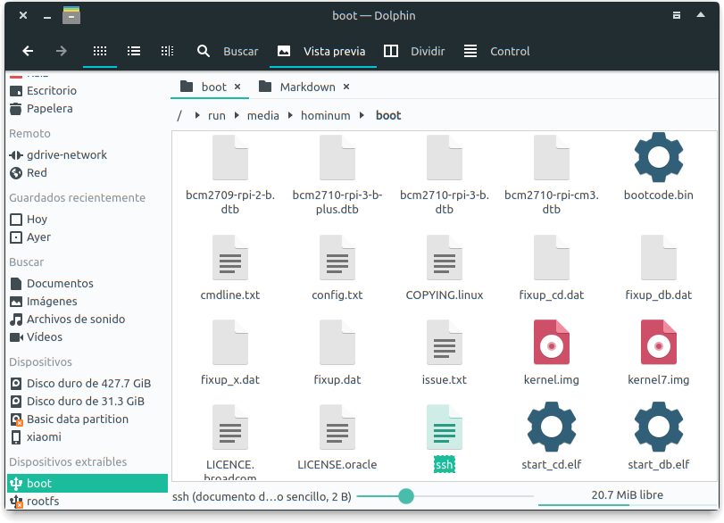

Aquí vemos el archivo plano y sin contenido llamado `ssh` en la partición `boot`. Puede contener texto, pero no es necesario. Como paso adicional, podemos habilitar la conexión `wifi` de manera automática. Para ello, creamos otro archivo de texto plano que contenga la información de nuestra red:


Deben respetarse las comillas en el caso del nombre de nuestra red y la contraseña. Guardamos el archivo como `wpa_supplicant.conf` en la misma partición `boot` y podemos ya insertar la tarjeta SD en nuestra `Raspberry`.


Lo ideal es utilizar conexión cableada, para disminuir el riesgo de una desconexión. Podemos encender la _Raspberry_ con solo el cable _Ethernet_ y la alimentación habilitados. Esperamos alrededor de un minuto para la primera vez (en esencia, la placa está lista cuando ya no hay parpadeo de color verde en los led's de la misma). Podemos entonces buscar la dirección de la _raspi_, utilizando el método que se desee. Por ejemplo, en el caso de usar `nmap` (https://nmap.org/download.html) basta con escribir `nmap -sn 192.168.0.0/24` para que haga un barrido rápido de todos los dispositivos conectados a la red `192.168.0.1`. Debe detectar la _raspi_ con el nombre que le hayamos dejado (por defecto, `raspberry`). En nuestro ejemplo, la _raspi_ tiene la dirección `192.168.0.9`:

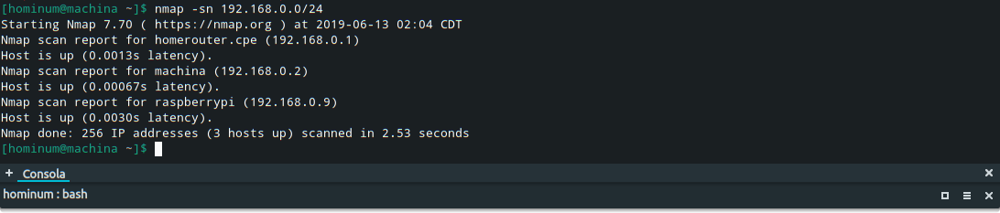

Para conectarnos vía `SSH` a la _raspi_ mediante _Windows_ o algún dispositivo móvil, necesitaremos una aplicación de terceros para lograrlo, pues en el caso de _Linux_ o _MacOS_ ya se encuentra habilitado por defecto. Para _Windows_ se sugiere `PuTTY`, cuya descarga se encuentra en la dirección: http://www.chiark.greenend.org.uk/~sgtatham/putty/download.html. Si se utiliza esta aplicación -la cual es sumamente sencilla de usar-, al ejecutarla hay que asegurarse de que esté seleccionado `SSH`, en la caja de texto `HostName` debe escribirse la dirección IP ya localizada de la _raspi_ y dar clic en `Open`. Enseguida debería aparecer un mensaje de advertencia referente a la seguridad del dispositivo: podemos ignorarla felizmente, aparece solo la primera vez al no conocer la placa, ya que nunca se había conectado a la misma. Posteriormente nos pedirá las credenciales de la _Raspberry_: `pi` como usuario y `raspberry` como contraseña si es que no se han modificado. Abrirá entonces una consola idéntica a la de _Raspbian_. Ya estamos conectados a la _raspi_.

Si por lo contrario, nos conectaremos con _Linux_ o con _MacOS_, basta con abrir una terminal y escribir: 

```bash
ssh pi@192.168.0.9
```

(recordemos que `192.168.0.9` es la dirección IP de nuestra placa). Nos lanzará una advertencia a la cual le respondemos «yes» y escribimos la contraseña cuando la pida (`raspberry` si no la hemos modificado). Ya estamos conectados.

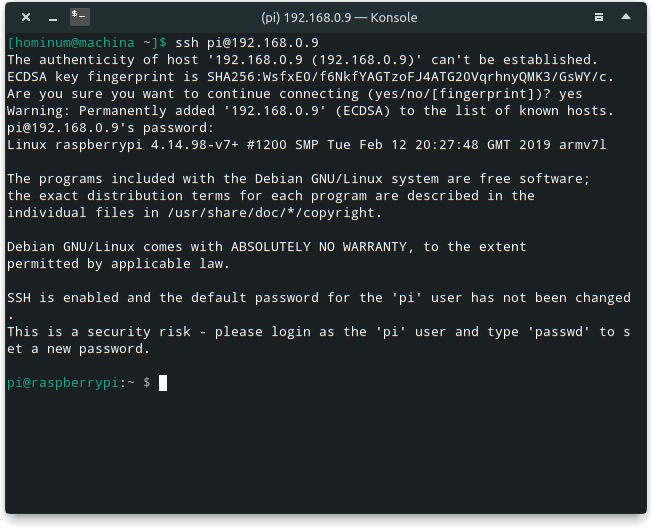

## Algunos ajustes adicionales

### Actualizar el sistema

Lo primero que deberíamos hacer es actualizar nuestro sistema operativo, primero actualizar repositorios:

```bash
sudo apt update
```

Enseguida actualizar paquetes:

```bash
sudo apt upgrade
```

### Optimizaciones

Ahora deberíamos configurar algunas cosas en _Raspbian_: la localización, la expansión del sistema de archivos y optimizar la memoria RAM. Esto lo haremos con el comando

```bash
sudo raspi-config
```

Si no hemos configurado la conexión _WiFi_ aún, es buen momento. Entramos en `raspi-config` $\rightarrow$ `Network Options` $\rightarrow$ `N2 Wi-fi` y allí nos pedirá que escribamos el nombre de red y la contraseña pertinentes.

### Asignar una IP fija

Trabajemos con conexión _Wi-Fi_ a partir de ahora. Será bastante conveniente que no tengamos que estar barriendo nuestra red en busca de la dirección IP de nuestra _raspi_ cada que tengamos que acceder a ella por `SSH`. Para ello, entramos a la misma después de, precisamente, haber encontrado su dirección actual.

```bash
ssh pi@192.168.0.12
```

> Si tenemos más de una _raspi_ o simplemente porque deseamos cambiarle el nombre, podemos hacerlo por medio del menú de inicio $\rightarrow$ _raspi-config_ $\rightarrow$ _Network Options_ $\rightarrow$ _N1 Hostname_. Aceptamos el mensaje y al dar _Enter_ podremos escribir el nuevo nombre con el que aparecerá la placa en la red.

Dentro de la _raspi_, ejecutamos

```bash
ifconfig
```

Nos aparecen las diferentes interfaces de conexión con las que cuenta la placa. Nos interesa la última: `wlan0`, de la cual nos quedaremos con el dato correspondiente a _inet_. 

> Aunque se asume que al entrar por `SSH`, se conoce la dirección IP de la _raspi,_ el anterior comando nos permite saber la misma desde la propia placa, por si en algún momento entramos en forma gráfica o por medio de monitor.

Ahora abriremos un archivo de configuración mediante _nano_:

```bash
sudo nano /etc/dhcpcd.conf
```

Nos vamos hasta el final del archivo y escribimos lo siguiente:

> interface wlan0
> 
> static ip_address=192.168.0.12/24
> static routers=192.168.2.1
> static domain_name_servers=192.168.0.1

Guardamos los cambios con `<ctrl>+o` y cerramos _nano_ con `<ctrl>+x`. Reiniciamos la _raspi_ y debería conectarse con la misma dirección.

### Habilitar el acceso como **root**

Es probable que queramos habilitar el acceso como usuario `root` a la _raspi_. Para ello accedemos como administrador al archivo de configuración del _demonio_ de SSH:

```bash
sudo su
nano /etc/ssh/sshd_config
```

Dentro del archivo buscamos la línea que diga `#PermitRootLogin prohibit-password` y la descomentamos (es decir, borramos la almohadilla), y sustituimos la frase _prohibit-password_ por _yes_. O sea, pasamos de esto:

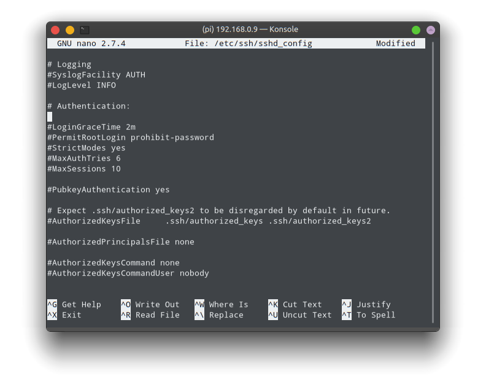

A esto:

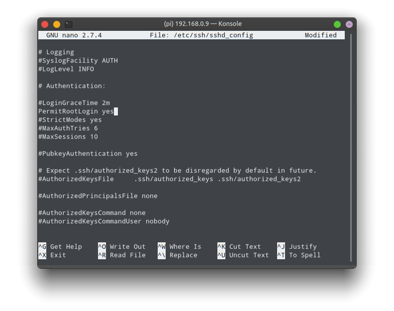

Guardamos el archivo (_Ctrl + O_ y enseguida _yes_) y toca reiniciar el servicio con la siguiente línea:

```bash
/etc/init.d/ssh restart
```

El siguiente paso es asignar la contraseña para el usuario _root_:

```bash
passwd root
```

El sistema nos solicitará que escribamos la contraseña dos veces. Es muy importante no olvidarla. Probemos el acceso. Escribimos `exit` para salir del modo súper usuario y de nuevo `exit` para salir de la conexión `SSH`. Enseguida accederemos con:

```bash
ssh root@192.168.0.9
```

### Crear un respaldo de nuestro sistema

#### MacOS y Linux

Si queremos reiniciar la placa debemos escribir:

```bash
sudo reboot
```

Y para apagar la _raspi_ es suficiente con escribir:

```bash
sudo shutdown -h now
```

En nuestro caso, la apagaremos para poder extraer la tarjeta SD. Después de escribir el comando anterior, esperaremos a que no haya ningún parpadeo verde en los LED's de la _raspi_. Retiramos la tarjeta y la insertamos en la computadora donde crearemos el respaldo. El método no difiere mucho en Mac o en Linux, pero sí en Windows. Para los primeros dos sistemas, necesitamos conocer el nombre de nuestra tarjeta cuando la hemos insertado. En una terminal, para Mac:

```bash
diskutil list
```

Típicamente nos mostrará la tarjeta SD como el último disco enlistado, con dos particiones, a saber: la primera, muy pequeña ($\approx$45MB), con formato _Windows_FAT_32_ y etiqueta _boot_; la segunda ($\approx$ el tamaño de la tarjeta SD) solo se identifica como _Linux_.

Para Linux:

```bash
sudo fdisk -l
```

Nos mostrará la totalidad de dispositivos externos. En el caso de nuestra tarjeta, la marcará como `/dev/sdb`, siempre y cuando solo esté uno solo conectado. De todas maneras, la podremos identificar por sus características, similares a las enlistadas por MacOS.

Procedemos a crear la imagen de respaldo. En la terminal, indistintivamente del sistema (MacOS o Linux) escribiremos el siguiente comando:

```bash
sudo dd if=/dev/sdb of=~/raspbianlite-01.dmg
```

Esto creará una imagen de disco del mismo tamaño que nuestra tarjeta de memoria, llamada `raspbianlite-01` en nuestro directorio _Home_. Esperamos unos minutos, dependiendo del tamaño de la SD. Al terminar, `dd` nos avisará cuánto copió y el tiempo que tardó en hacerlo. Se recomienda comprimir la imagen resultante, quedando en un archivo de $\approx$2.3GB para una tarjeta de 16GB. Como montaremos los respaldos utilizando _Etcher_, no hay problema con el formato, recordemos que esta aplicación puede leer archivos _*.zip_.

#### Windows

Para este sistema se ponen las cosas un poco más sencillas. Con la tarjeta SD insertada en la computadora en la que haremos el respaldo procedemos a descargar la aplicación _Win32 Disk Imager_ desde https://sourceforge.net/projects/win32diskimager/ y ejecutarla. En la sección de _Image File_ vamos a seleccionar la ruta donde guardaremos la imagen de nuestra SD. En la sección _Device_ seleccionamos la SD y presionamos _Read_. Esperamos a que termine y ya tenemos nuestra imagen.

### Restaurar el respaldo

El procedimiento es común para todos los sistemas. Simplemente montamos la imagen en una tarjeta SD formateada con _Etcher_, tal como montamos _Raspbian_ en secciones anteriores.

## Los pines GPIO's y su control

### Esquema

Son el medio de comunicación entre el mundo real y nuestra _Raspberry Pi_. Existen dos maneras de identificar los pines: BCM y BOARD. Por lo regular, se utiliza la primera, cuya numeración es como sigue:

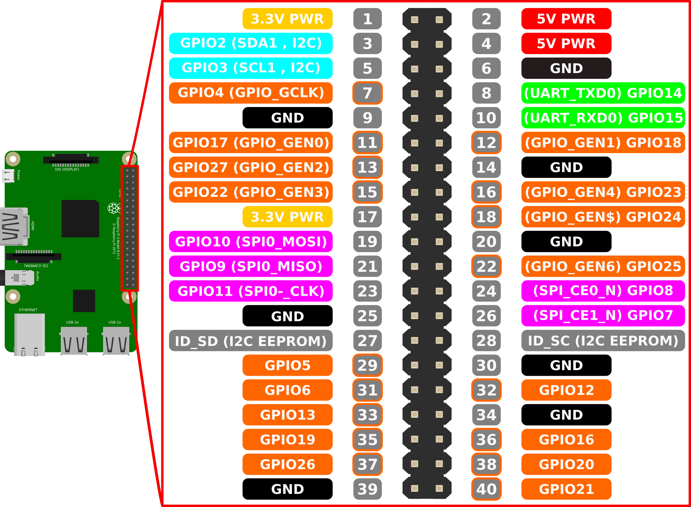

> **_Nota_**: en este diagrama se asume que los puertos USB de la _raspi_ están apuntando hacia abajo, viéndola desde la parte superior. Para mayor información, la página https://es.pinout.xyz/ es muy buena fuente.

### Python ex machina

Comencemos a trabajar con _Python_ desde la terminal. Abrimos una y escribimos:

```python
python3 #damos <Enter> y aparecerá el siguiente mensaje:

Python 3.5.3 (default, Sep 27 2018, 17:25:39) 
[GCC 6.3.0 20170516] on linux
Type "help", "copyright", "credits" or "license" for more information.
>>>
```

Cabe mencionar que `>>>` es conocido como el _prompt_ de _Python_, apareciendo para indicar que está listo para recibir instrucciones. Por lo tanto, lo que a partir de ahora aparezca sin dicho símbolo es la salida a las órdenes que hemos dado al programa. Juguemos un poco con el _software_:

```python
>>> 1+1 #capturamos una simple suma y damos <Enter>:
2
>>> 2**3 #elevamos 2 al cubo:
8
>>> resultado = 15/2 #«declaramos» una variable:
>>> resultado #traemos el valor de dicha variable
7.5
>>> print(resultado) #también podemos «imprimir» la variable
7.5
>>> otro_resultado = 17/6 #calculemos un decimal largo
>>> print(otro_resultado)
2.8333333333333335
>>> round(otro_resultado) #redondeamos al entero más próximo
3
>>> round(otro_resultado,1) #redondear a un decimal
2.8
>>> round(otro_resultado,2) #ahora a dos decimales
2.83
>>> str = 'Python' #creamos una variable con caracteres
>>> print(str) #y la imprimimos
Python
>>> print(str + '3' + ' ' + 'por defecto') #imprimimos una cadena concatenada
Python3 por defecto
>>> print(str + '3' + ' ' + 'es igual a ' + str * 3) #podemos «multiplicar» los caracteres
Python3 es igual a PythonPythonPython
>>> str[3] #mostremos solo el tercer caracter de la cadena'h'
```

### Definamos una función

A continuación crearemos una muy sencilla función en _Python_ que hará exactamente lo mismo que cuando multiplicamos la cadena de caracteres. Primero debemos definir dicha función, es decir, darle un nombre. Para ello escribimos la palabra reservada `def` y enseguida el nombre que le pondremos a la operación, abrimos paréntesis y dentro de ellos escribiremos el parámetro con el que trabajará la función. En la siguiente línea definiremos el funcionamiento: nuestra función multiplicará por tres la cadena de caracteres e imprimirá el resultado. Cabe mencionar que _Python_ o bien, presionar una sola vez la tecla _tab_ no utiliza llaves o algún otro símbolo para anidar. Más bien, para definir qué es lo que forma parte de la función es la identación. En la terminal basta con dar tres espacios vacíos antes de comenzar a escribir la siguiente línea. También es de notar que cuando _Python_ sabe que falta código para definir algo, no muestra el _prompt_ sino, más bien, tres puntos suspensivos. Con esto da a entender que espera aún más código.

Posteriormente la ejecutamos:

```python
>>> def mult_str(strn): #primero su nombre y enseguida el parámetro
...    print(3 * strn) #operación a realizar
... 			#espacio vacío, ya terminamos
>>> mult_str('Hola ')  #ejecutamos la función
Hola Hola Hola 	 #y muestra el resultado
```

Definamos una función un poco más compleja. Queremos que tome del usuario la cadena de caracteres que desee (parámetro `strn`), y la multiplique por un número que también se especifique (`n`).

```python
>>> def mult_str(strn,n):
...     print(n * strn)
... 
>>> mult_str('Hallo ', 4)
Hallo Hallo Hallo Hallo
>>> mult_str('Hola ', 10)
Hola Hola Hola Hola Hola Hola Hola Hola Hola Hola 
>>>
```

Podemos salir del entorno interactivo de _Python_ con el comando

```python
>>> quit()
```

### Escribamos un programa 

Para poder crear nuestras aplicaciones, es recomendable utilizar _scripts_, esto es, archivos de texto que mandaremos ejecutar. La ventaja es que no necesitamos estar tecleando los comandos en tiempo real. Para este caso, utilizaremos un veterano editor de textos: _Vim_. _Vim_ no se encuentra instalado en su edición completa por defecto en _Raspbian Lite_, así que actualizamos repositorios, esperamos; actualizamos el sistema, esperamos; y enseguida lo instalamos:

``` bash
sudo apt update #esperamos a que termine
sudo apt upgrade #esperamos más
sudo apt install vim #y volvemos a esperar
```

Es momento de escribir nuestro primer programa. Crearemos con _Vim_ un archivo con extensión _*.py_ (para que _Python_ pueda ejecutarlo). Así que por medio de `SSH` procedemos a trabajar en la _Raspi_:

```bash
vim ejemplo.py
```

Y aparecerá una pantalla muy espartana, vacía. A modo de tutorial exprés de _Vim_, cabe decirse que el editor de textos tiene dos modos: modo de edición y modo de navegación. Por defecto no está en modo edición, para entrar en él presionamos la tecla `<i>` y veremos que en la parte inferior pone: `-- INSERT --`. Estamos en modo de edición. Escribimos el siguiente texto, cuidando identaciones y cambio de líneas. 

```python
def mult_str(strn, n):
    print(n * strn)
    
mult_str('Hola ', 3)
```

Cuando hayamos terminado, presionaremos una sola vez la tecla `<ESC>` para salir de la edición y enseguida presionaremos `<:w>`, es decir, `<shift> + .` y enseguida `<w>`. Con eso guardaremos los cambios. Luego podemos escribir `<:q>` para salir de _Vim_.

Ahora toca ejecutar el archivo. Un comando bastante útil para enlistar todos los ficheros y archivos que se encuentran en un directorio determinado es `ls`. Podemos complementarlo para que muestre también los archivos ocultos mediante `ls -al`. 

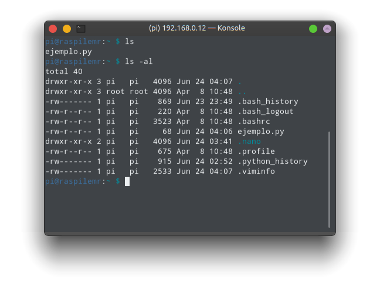

Ejecutamos escribiendo el nombre de la aplicación que abrirá el archivo y enseguida el nombre del propio archivo:

```bash
python3 ejemplo.py
```

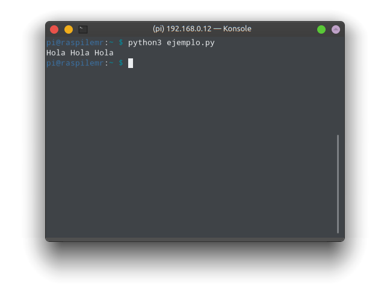

Démosle mayor flexibilidad a nuestro pequeño programa. Hagamos una copia del original _ejemplo.py_ mediante el comando `cp` y modifiquémosla:

```bash
cp ejemplo.py ejemplo2.py
```

Comprobemos que se haya creado la copia:

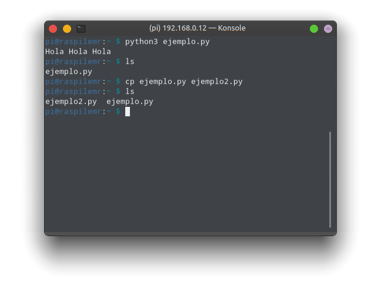

Ahora toca editar el anterior archivo de texto:

```bash
vim ejemplo2.py
```

Se abrirá _Vim_ y presionamos `<i>` para poder editar. Necesitamos obtener interacción con el usuario, por medio del sistema operativo. Por lo tanto, debemos importar un módulo que nos lo permita. Para el caso de _Python_, será `sys`. Para importar un módulo o librería, debe escribirse al principio del programa `import sys`, y en el cuerpo de la función incluir el código necesario para obtener la interacción. En nuestro caso, solicitaremos dos datos al usuario: el primero será una cadena de caracteres y el segundo tiene que ser un número. Por esa razón, deberemos convertir un caracter a _entero_, mediante `int`. En nuestro código, pediremos los datos por medio de la función `sys.argv[a]`, donde `a` se refiere al número de entrada. Es decir, como pediremos dos datos, deberemos repetir la función, diferenciándolas con el número en el corchete, siendo el [1] el primer argumento y el [2] el segundo valor que deberemos introducir. El código quedaría así:

```python
import sys

def mult_str(strn, n):
    print(n * strn)
    
mult_str(sys.argv[1], int(sys.argv[2]))
```

Guardamos y salimos de _Vim_, para ejecutar en la terminal:

```bash
python3 ejemplo2.py `Hola ` 6
```

Notemos pues que el primer valor sí es una cadena de caracteres mientras que, el segundo dato sí debe ser un número. Notemos también que en el código convertimos el caracter `6` en un número entero.

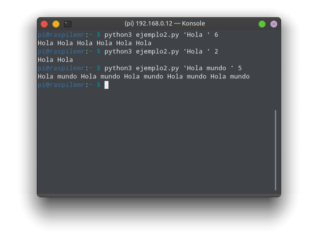

Podemos visualizar el contenido de un archivo de texto por medio de `cat`:

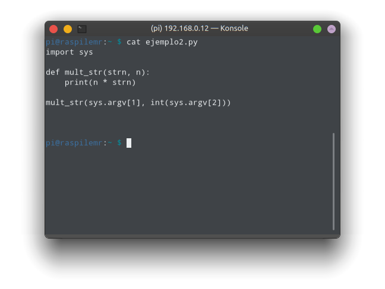

### Armemos el circuito

El circuito es relativamente sencillo. A continuación se muestra el diagrama elaborado con Fritzing. En el diagrama se muestra la conexión del led, el botón, el sensor DHT22 y sus respectivas resistencias.

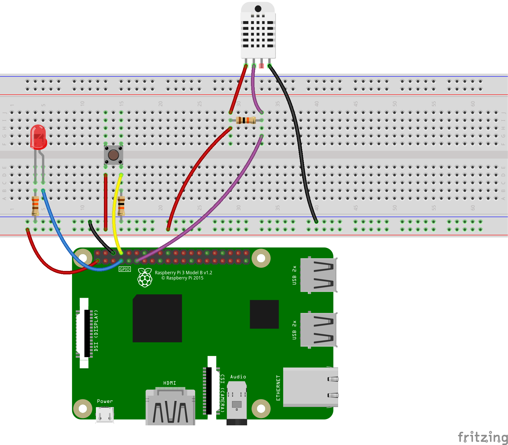

Generalmente se utilizan conexiones o cables de color rojo para la alimentación, que en este caso es de 3.3V; los cables de color negro son para conectar a _tierra_ y los demás colores quedan reservados para las señales de entrada o salida de la _raspi_. Cabe mencionar que voltaje y _tierra_ se conectan a los rieles laterales de la tablilla de prototipado, para de allí llevarlos a donde fuesen necesarios.

### Instalando todo lo necesario en Python

_Pip_ es un instalador para _Python_, una especie de `apt` que nos permitirá acceder a una mayor cantidad de librerías y aplicaciones. Su instalación es muy sencilla. Abrimos una terminal y ejecutamos el siguiente comando:

```bash
sudo apt install python3-pip
```

Al dar _Enter_, después de un pequeño intervalo nos pedirá autorización para continuar con la instalación. La aceptamos escribiendo una _y_. Toca esperar a que descargue lo necesario y proceda a instalar. Tardará unos segundos.

También necesitamos la librería `RPi.GPIO`. La conseguiremos con nuestro flamante `pip`:

```bash
pip3 install rpi.gpio
```

Esperamos un poco, es bastante rápido.

### Encendiendo el LED en tiempo real

Con el circuito que ya tenemos armado podemos comenzar a probar la librería que acabamos de instalar. Para ello comenzaremos con el LED. Es muy importante que revisemos el diagrama que muestra los pines numerados de la _raspi_ para no equivocarnos con el código. Ejecutamos `python3` en la terminal y esperamos al _prompt_. Lo primero que debemos realizar es importar la librería RPi.GPIO:

```python
>>> import RPi.GPIO as GPIO
```

El siguiente paso es opcional, podemos declarar el pin más adelante, pero tengamos un poco de orden en nuestro código: declaremos el pin donde conectaremos el LED.

```python
>>> led = 7
```

Definamos la manera en la que leeremos los pines de la _raspi_, ya sea de manera física o lógica. Aunque en este caso usaremos la notación física. Es decir, contaremos los pines, comenzando por el superior izquierdo (siempre viendo la _raspi_ desde arriba y con los puertos USB apuntando hacia abajo), el cual sería el pin 1. El pin a su derecha sería el 2 y el pin justo debajo sería el 3; así sucesivamente.

```python
>>> GPIO.setmode(GPIO.BOARD)
```

Ahora definiremos el tipo de función que el pin  7 asumirá, ya sea entrada o salida. Como controlaremos un LED, entonces será un pin de salida:

```python
>>> GPIO.setup(led, GPIO.OUT)
```

Es momento de encender el dispositivo. Para ello haremos que el GPIO esté en HIGH para encender y en LOW para apagarlo. Encendámoslo primero:

```python
>>> GPIO.output(led, GPIO.HIGH)
```

Ahora lo apagamos:

```python
>>> GPIO.output(led, GPIO.LOW)
```

Repitamos la misma acción, después de salir de `Python`, pero ahora leyendo los pines con el acomodo lógico (tipo `BCM`):

```python
>>> import RPi.GPIO as GPIO
>>> led = 4 #el pin 7 es en realidad el GPIO4
>>> GPIO.setmode(GPIO.BCM)
>>> GPIO.setup(led, GPIO.OUT)
>>> GPIO.output(led, GPIO.HIGH) #encender
>>> GPIO.output(led, GPIO.LOW) #apagar
```

### Leyendo el estado del botón

Ahora estaremos sensando continuamente el estado de un botón. No trabajaremos de manera «interactiva», ahora escribiremos los comandos en un archivo _boton.py_:

Importamos la librería:

```python
import RPi.GPIO as GPIO
```

Necesitamos importar también `time` para programar un contador:

```python
import time
```

Declaramos el pin al que conectamos el botón:

```python
boton = 8
```

Apagamos todas las advertencias:

```python
GPIO.setwarnings(False)
```

Definimos la numeración de los pines como física:

```python
GPIO.setmode(GPIO.BOARD)
```

Configuramos el pin como _entrada_:

```python
GPIO.setup(boton, GPIO.IN)
```

Programaremos un ciclo que se estará repitiendo indefinidamente, para revisar siempre el estado del botón. Introducimos pues un `while` en nuestro código que leerá la entrada y reaccionará a lo que ocurra, mostrando el estado presente:

```python
while True:
    valor = GPIO.input(boton) 
    if valor:
        print("No presionado")
    else:
        print("Presionado")
    time.sleep(0.1)
```

Terminamos el código con la limpieza de las señales:

```python
GPIO.cleanup()
```

El código completo sería:

```python
import RPi.GPIO as GPIO
import time

boton = 8
GPIO.setwarnings(False)
GPIO.setmode(GPIO.BOARD)
GPIO.setup(boton, GPIO.IN)

while True:
    valor = GPIO.input(boton)
    print(valor)
    if valor:
        print("No presionado")
    else:
        print("Presionado")
    time.sleep(0.1)

GPIO.cleanup()
```

Lo ejecutamos:

```python
python3 boton.py
```

Podemos detener el programa presionando `<CTRL> + C`.

### Controlar el led con el botón

A continuación controlaremos el encendido del led por medio del botón, es decir, encenderemos el led cuando lo presionemos. Vamos a importar la misma librería `RPi.GPIO`, además de `time`. Apagaremos las advertencias, usaremos la numeración física de la _raspi_ y definiremos los roles de los pines donde conectaremos el botón y el led. Para realizar la función del sensado del estado del botón y su posterior reacción (esto es, encender el led), crearemos un ciclo infinito que al detectar un 1 como señal del botón, mande señal `high` al led. El código quedaría de la siguiente manera:

```python
import RPi.GPIO as GPIO
import time
boton = 8
led = 7
GPIO.setwarnings(False)
GPIO.setmode(GPIO.BOARD)
GPIO.setup(boton, GPIO.IN)
GPIO.setup(led, GPIO.OUT)

while True:
    valor = GPIO.input(boton)
    print(valor)
    if valor:
        print("Presionado")
        GPIO.output(led, GPIO.HIGH)
    else:
        print("No presionado")
        GPIO.output(led, GPIO.LOW)
    time.sleep(0.1)
    
GPIO.cleanup()
```

Lo creamos como _boton_led.py_, lo editamos, lo guardamos, ejecutamos y probamos.

### Preparando todo para el sensor

Debemos instalar `git` para poder utilizar el sensor, ya que necesitamos su librería. Lo realizamos con:

```bash
sudo apt install git-core
```

Configuramos para usar nuestro correo:

```bash
git config --global user.email lemendoza@upgop.edu.mx
```

 y nombre:

```bash
git config --global user.name "Luis"
```

Y ahora es momento de clonar el repositorio que nos interesa:

```bash
git clone https://github.com/adafruit/Adafruit_Python_DHT.git
```

Verificamos con `ls -al` que se encuentre el directorio _Adafruit_Python_DHT_ y entramos en él:

```bash
cd Adafruit_Python_DHT
```


Lo revisamos (de nuevo con `ls -al`) en busca del ejecutable _setup.py_. Lo ejecutaremos mediante:

```bash 
sudo python3 setup.py install
```

No debería de ocurrir ningún inconveniente. Es hora de probar nuestro sensor.

### Uso del sensor DHT22

A modo de ejemplo, podemos utilizar el archivo que contiene el repositorio de _Adafruit_. Para ello, primero debemos definir qué sensor estamos utilizando, ya sea el DHT11, DHT22 o la versión de Adafruit: el AM2302. Hecho esto, determinamos e GPIO donde conectamos el sensor, si lo hicimos de acuerdo al circuito propuesto antes, es el _17_. Entramos en el directorio y luego en _examples_, ejecutando _AdafruitDHT.py_:

```bash
python3 AdafruitDHT.py 2302 17
```

Los pasos sucesivos y un posible resultado se muestran a continuación:

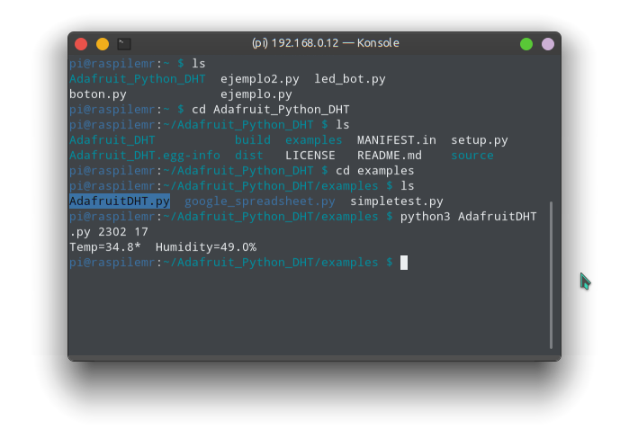

Se pueden modificar algunos parámetros del sensor mediante ese archivo, lo cual se deja como opcional, por sí mismo, el resultado es adecuado.

## Preparando la base de la aplicación Web

La estructura de nuestra aplicación quedaría como sigue: 

El hardware viene siendo, obviamente, la _raspi_. El sistema operativo sigue siendo _Raspbian_, en la versión de la que se disponga. La aplicación estará hecha en _Python_. El framework de la app será _Flask_, mientras que _uWSGI_ será el servidor de la aplicación. Por otro lado, _NGINX_ será el servidor web. El usuario podrá visualizar los datos en su propio navegador. 

Es importante mencionar que debemos preparar el entorno virtual de _Python_, el cual estará conformado por la aplicación misma, _Flask_ y _uWSGI_. Esto es, para poder utilizar módulos o paquetes dedicados a cada aplicación, sin tener que compartirlos entre las mismas.

### Preparando el sistema Python

Es necesario instalar la versión más reciente de _Python_, debido a que debe compilarse con todas las librerías adecuadas. La instalación se conseguirá siguiendo el siguiente conjunto de instrucciones:

Primero, entrar como usuario _pi_ y no como _root_; actualizar el sistema operativo (_update_ y _upgrade_), y enseguida instalar el paquete _build-essential_:

```bash
sudo apt install build-essential
```

Es probable que ya se encuentre instalado. Proseguimos con la instalación de algunas librerías más:

```bash
sudo apt install libncurses5-dev libncursesw5-dev libreadline6-dev libffi-dev
```

Unas más:

```bash
sudo apt install libbz2-dev libexpat1-dev liblzma-dev zlib1g-dev libsqlite3-dev libgdbm-dev tk8.5-dev
```

Y ahora, instalaremos el paquete de desarrollo de _python_:

```bash
sudo apt install python-dev
```

Y para finalizar con la preparación, es necesario instalar _ssl_ también:

```bash
sudo apt install libssl-dev openssl
```

### Compilando e instalando Python3

Necesitamos la versión más reciente de _Python_, por lo tanto, debemos descargar el código fuente del mismo. Para ello, nos vamos al apartado de _Descargas_ de _Python.org_ (https://www.python.org/downloads/) y damos clic en la última versión para copiar la dirección del vínculo (en este momento, julio de 2019, es la 3.7.3 y su enlace de descarga es https://www.python.org/ftp/python/3.7.3/Python-3.7.3.tgz).

De vuelta en la _raspi_, crearemos una carpeta llamada _python-source_:

```bash
mkdir python-source
```

Entramos en ella y descargamos, ahora sí, _Python3.7.3:

```bash
wget https://www.python.org/ftp/python/3.7.3/Python-3.7.3.tgz
```

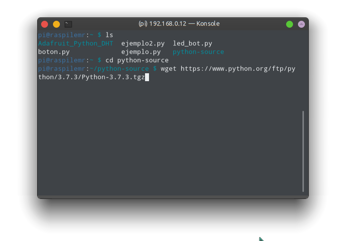

Descomprimimos, siempre dentro de la misma carpeta _python-source_:

```bash
tar zxvf Python-3.7.3.tgz
```

Se creará un directorio llamado Python-3.7.3, entramos en él y ejecutamos el archivo _configure_ con una ruta de instalación adecuada:

```bash
./configure --prefix=/usr/local/opt/python-3.7.3
```

Tardará bastante tiempo, avisados estamos. Cuando haya terminado, ejecutamos _make_:

```bash
make
```

Y al terminar, después de aún mucho más tiempo, ejecutamos la instalación, propiamente dicha:

```bash
sudo make install
```

Es importante que la instalación reinstale los paquetes que hemos instalado, como _pip_, por ejemplo. Eso lo podemos comprobar al final del proceso, donde lo indica en pantalla (_Collecting pip_). Ya para asegurarnos que todo fue bien, es útil revisar la versión instalada en el directorio que configuramos en el paso de _configure_:

```bash
/usr/local/opt/python-3.7.3/bin/python3.7 --version
```

Debe devolver:

```bash
Python 3.7.3
```

¡Es momento de hacer un respaldo de la tarjeta SD!

### Creando el entorno virtual Python para nuestra aplicación

Debemos acceder como _root_:

```bash
sudo su
```

Enseguida entramos al directorio _/var_:

```bash
cd /var
```

Creamos una carpeta llamada _www_:

```bash
mkdir www
```

Entramos en él:

```bash
cd www
```

Creamos otra carpeta, llamada _lab_app_:

```bash
mkdir lab_app
```

Y entramos en ella:

```bash
cd lab_app
```

Aquí viene algo importante, crearemos el entorno virtual con el siguiente comando, escrito en la carpeta _lab_app_:

```bash
/usr/local/opt/python-3.7.3/bin/python3.7 -m venv .
```

Con esto se copiaron los archivos necesarios para «ejecutar» _Python_ en el directorio. Sin embargo, aún no está activada la versión más reciente en dicha carpeta. Si preguntamos por la versión dentro de la misma carpeta _lab_app_, nos dirá que tiene la misma que el sistema (en estos momentos, julio de 2019, es la 2.7.13):

```bash
python --version
```

Así que debemos activarla:

```bash
. bin/activate
```

Los pasos sucesivos se muestran en la siguiente captura de pantalla:

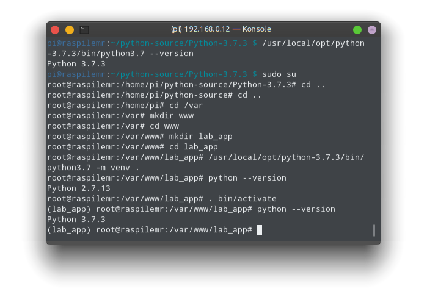 

### Instalar NGINX

En el mismo directorio donde nos quedamos en el paso anterior, y seguros de que está activado _Python-3.7.3_ y somos _root_, procedemos a instalar _NGINX_:

```bash
apt install nginx
```

Al terminar, podemos comprobar el buen funcionamiento de _NGINX_ al acceder a la dirección de la _raspi_:

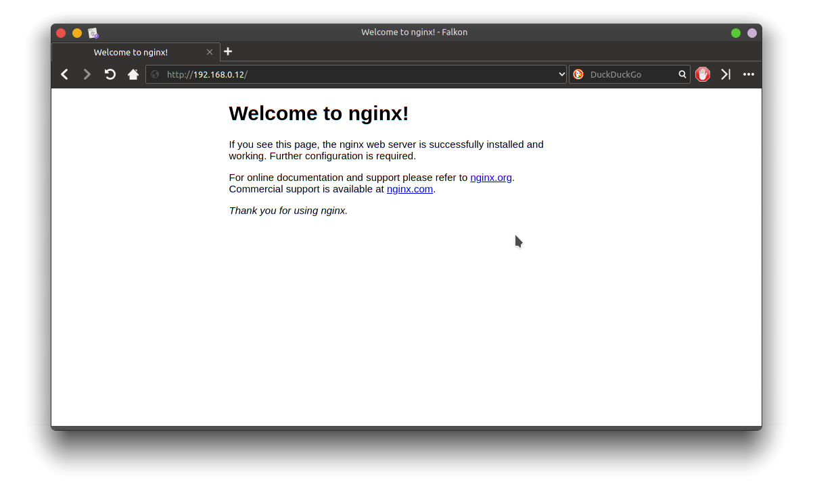

### Instalar FLASK

Mismo directorio que en el paso anterior, con _Python_ activado, instalamos _FLASK_ con _pip_:

```bash
pip install flask
```

Crearemos un pequeño archivo _hola.py_ con un clásico _Hola Mundo_:

```python
from flask import Flask
app = Flask(__name__)
@app.route("/") #ruta de la app

def hola():
    return "¡Hola Mundo!"

if __name__ == "__main__":
    app.run(host='0.0.0.0', port=8080)
```

Y siempre en el mismo directorio, ejecutamos el archivo:

```bash
python hola.py
```

En la terminal nos avisa que se está ejecutando y menciona que podemos detenerlo con `CTRL+C`. Sin quitarlo, abrimos el navegador y abrimos la dirección de la _raspi_, finalizando con el puerto que escribimos en el archivo (8080). Debería aparecer el clásico mensaje:


Para mayor información, podríamos dirigirnos a la página del proyecto: http://flask.pocoo.org/, que es donde pertenece el ejemplo del _«Hola Mundo»_.

Podemos modificar nuestro archivo para escribir más «aplicaciones» en _Flask_. Agreguemos lo siguiente justo antes del `if`:

```python
@app.route("/ejemplo") #otra ruta
def ejemplo():
    return "Esto es un ejemplo"
```

Y al abrirlo en el navegador:

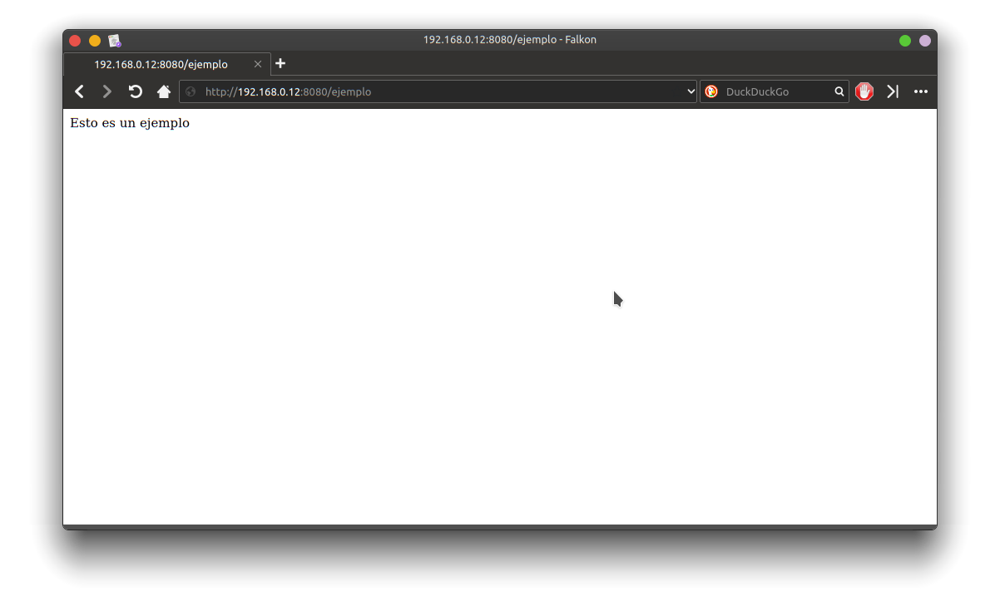

### Instalación de uWSGI

Comenzamos con la instalación de uWSGI:

```bash
pip install uwsgi
```

Esperamos un poco y enseguida comprobamos que se encuentre instalado en nuestra carpeta, uWSGI:

```bash
ls -al bin
```

### Configuración de NGINX

Debemos acceder al archivo de configuración, podemos verlo mediante:

```bash
cat /etc/nginx/sites-enabled/default
```

Podemos sacar algo de información valiosa de aquí, pero por lo pronto, lo eliminaremos:

```bash
rm /etc/nginx/sites-enabled/default
```

Crearemos otro:

```bash
vim lab_app_nginx.conf
```

Y en él escribiremos:

```nginx
server {
    listen 80;
    server_name localhost;
    charset utf-8;
    client_max_body_size 75M;

    location /static {
        root /var/www/lab_app/;
    }

    location / { try_files $uri @labapp; }
    location @labapp {
        include uwsgi_params;
        uwsgi_pass unix:/var/www/lab_app/lab_app_uwsgi.sock;
    }
}
```

Ahora enlazamos el archivo de configuración que hemos creado con el de configuración del «demonio» de _NGINX_:

```bash
ln -s /var/www/lab_app/lab_app_nginx.conf /etc/nginx/conf.d/
```

Comprobamos que el enlace se haya creado correctamente mediante 

```bash
ls -al /etc/nginx/conf.d/
```

Debe aparecer el archivo de configuración apuntando hacia la dirección real del que acabamos de crear mediante _vim_.

Reiniciamos _nginx_ por medio de _systemctl_ para arrancarlo como un servicio:

```bash
/etc/init.d/nginx restart
```

No debería surgir problema alguno.

### Configurando uWSGI

Seguimos en el mismo directorio, asegurándonos de tener aún activado _lab_app_. Crearemos un archivo por medio de _vim_, en la siguiente dirección:

```bash
vim lab_app_uwsgi.ini
```

Y en él, escribiremos lo siguiente:

```bash
[uwsgi]
#application's base folder
base = /var/www/lab_app

#python module to import
app = hola-mundo
module = %(app)

home = %(base)
pythonpath = %(base)

#socket file's location
socket = /var/www/lab_app/%n.sock

#permissions for the socket file
chmod-socket = 666

#the variable that holds a flask application inside the module imported at line #6
callable = app

#location of log files
logto = /var/log/uwsgi/%n.log
```

Guardamos y salimos de _vim_. Ahora crearemos un directorio llamado uwsgi:

```bash
mkdir /var/log/uwsgi
```

Para mayor información, podemos dirigirnos a la documentación de _uWSGI_: https://uwsgi-docs.readthedocs.io/en/latest/Configuration.html.

### Probando uWSGI y Nginx

Seguimos en el mismo directorio. Escribimos lo siguiente:

```bash
bin/uwsgi --ini /var/www/lab_app/lab_app_uwsgi.ini
```

Debemos crear un archivo de arranque para _uWSGI_, lo cual se hará así:

```bash
vim /etc/systemd/system/emperor.uwsgi.service
```

Y dentro de él, escribimos:

```bash
[Unit]
Description=uWSGI Emperor
After=syslog.target

[Service]
ExecStart=/var/www/lab_app/bin/uwsgi --ini /var/www/lab_app/lab_app_uwsgi.ini
# Requires systemd version 211 or newer
RuntimeDirectory=uwsgi
Restart=always
KillSignal=SIGQUIT
Type=notify
StandardError=syslog
NotifyAccess=all

[Install]
WantedBy=multi-user.target
```

Para comprobar el funcionamiento, arranquemos el proceso:

```bash
systemctl start emperor.uwsgi.service
```

Verifiquemos el estado:

```bash
systemctl status emperor.uwsgi.service
```

Ahora podemos acceder a la app _ejemplo_ por medio de la dirección _192.168.0.12/ejemplo_:

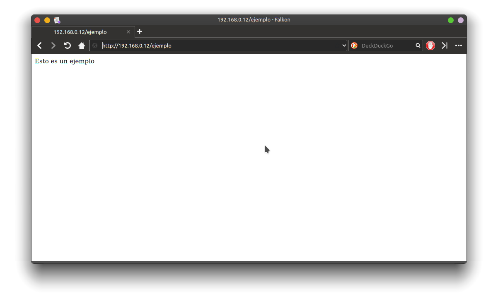

Para obligar a la _raspi_ a que siempre ejecute _uWSGI_ al arranque, es necesario escribir el siguiente comando que modifica a _systemd_ (es el sistema que gestiona los procesos de arranque en Linux, por así decirlo):

```bash
systemctl enable emperor.uwsgi.service
```

Podemos reiniciar la _raspi_ y comprobar, después de un tiempo, que la app _hola-mundo_ se encuentra trabajando en la dirección _192.168.0.12_. Es momento de realizar otro respaldo de la tarjeta SD.

## Estilizando nuestra app

### Trabajando con SQlite3

Nos convertimos en _root_ y accedemos al mismo directorio:

```bash
cd /var/www/lab_app
```

Estando allí, instalamos _sqlite3_:

```bash
apt install sqlite3
```

Esperamos a que finalice la instalación. Enseguida ejecutamos lo siguiente:

```bash
sqlite3 sample.sql
```

Podemos acceder a la ayuda de la aplicación con:

```sqlite
.help
```

Arrancamos con:

```sqlite
begin;
```

Vamos a crear una tabla en la cual, almacenaremos los valores obtenidos por el sensor con las siguientes columnas:

```sqlite
create table temperaturas (rDatetime datetime, sensorID text, temp numeric);
```

Esto es, la fecha y hora actuales, el número de sensor y la temperatura como tal. Y ahora, insertaremos algunos valores ficticios:

```sqlite
insert into temperaturas values (datetime('now'),"1",25.10);
```

Confirmamos:

```sqlite
commit;
```

Veamos los datos introducidos:

```sqlite
select * from temperaturas;
```

Debería de aparecer lo antes capturado:

```sqlite
2019-07-11 03:11:56|1|25.1
```

Salgamos:

```sqlite
.exit
```

### Configurando

Entramos a la carpeta de siempre como _root_ y crearemos el directorio _static_:

```bash
root@raspilemr:/var/www/lab_app# mkdir static
```

Entramos y creamos un par de directorios, llamados _css_ y _images_:

```bash
root@raspilemr:/var/www/lab_app/static# mkdir css
```

```bash
root@raspilemr:/var/www/lab_app/static# mkdir images
```

Ahora, dentro del directorio _static_, crearemos un archivo _html_ estático, mediante vim:

```
vim a_static_file.html
```

Y escribimos (o copiamos) lo siguiente:

```html
<html>
<head>
<title>Página estática</title>
</head>
<body>
<h1>Este es un ejemplo de una página estática</h1>
<p>Lo es, ¿o no?</p>
</body>
</html>
```

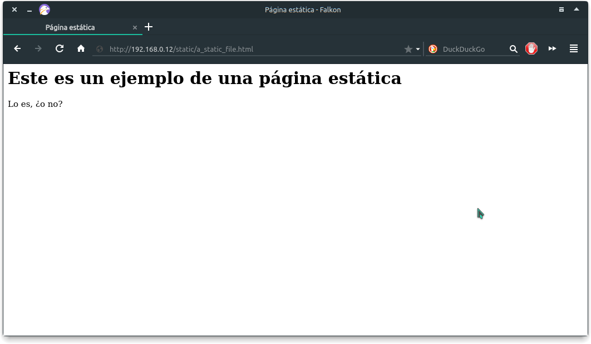

Toca descargar una plantilla para estilizar nuestra web. En este caso, una llamada _Skeleton_ es buena alternativa. Podemos obtenerla desde http://getskeleton.com/. Lo ideal es pues, descargarla desde su página, descomprimirla y luego, mediante alguna aplicación ftp, compartirla con la _raspi_. En nuestro caso, usamos _Filezilla_, usando _root_ como usuario, con la contraseña que anteriormente definimos y el puerto 22:

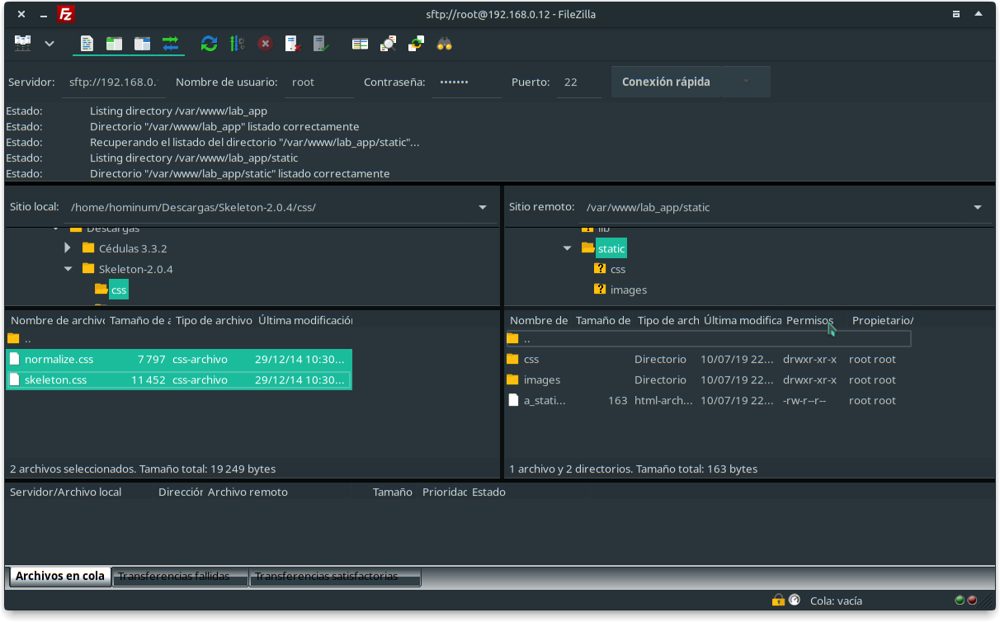

Copiaremos los archivos dentro de las carpetas _css_ y _html_ a las nuestras que están en la _raspi_, al igual que la imagen dentro de _images_. Confirmamos que los archivos están donde deben:

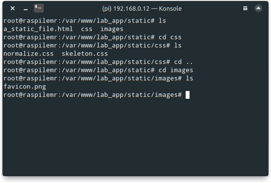

Editaremos el archivo _a_static_file.html_ de nuevo con _vim_. Justo antes de la línea `title` escribimos:

```html
<meta charset="utf-8">
```

y justo después:

```html
<!-- Mobile Specific Metas
  –––––––––––––––––––––––––––––––––––––––––––––––––– -->
  <meta name="viewport" content="width=device-width, initial-scale=1">
  <!-- FONT
  –––––––––––––––––––––––––––––––––––––––––––––––––– -->
  <link href="//fonts.googleapis.com/css?family=Raleway:400,300,600" rel="stylesheet" type="text/css">
  <!-- CSS
  –––––––––––––––––––––––––––––––––––––––––––––––––– -->
  <link rel="stylesheet" href="css/normalize.css">
  <link rel="stylesheet" href="css/skeleton.css">
  <!-- Favicon
  –––––––––––––––––––––––––––––––––––––––––––––––––– -->
<link rel="icon" type="image/png" href="images/favicon.png">
```

Con esto ya hemos aplicado, por así decirlo, la plantilla de nuestra página estática.

### Plantillas de Flask

Subiremos al directorio _lab_app_ y creamos una carpeta llamada _templates_. No entraremos en ella, pero sí abriremos el archivo _hola-mundo.py_ que habíamos creado al comienzo. Agregaremos unas cuantas líneas, por lo que el archivo quedará así:

```python
from flask import Flask
from flask import render_template

app = lask(__name__)
app.debug = True

@app.route("/")
def hola():
    return render_template('hola.html', message="¡Hola, mundo!")

@app.route("/ejemplo")
def ejemplo():
    return "Esto es un ejemplo"

if __name__ == "__main__":
    app.run(host='0.0.0.0', port=8080)
```

Importante notar la línea `app.debug = True`. Con ella hemos habilitado la posibilidad de depurar y encontrar posibles errores. Pero para ello, debemos activar _Python_. Recordemos que se activa con el comando:

```bash
. bin/activate
```

Y luego ya podemos depurar ejecutando nuestro archivo:

```bash
python hola-mundo.py
```

Continuando, entramos al directorio _templates_ y creamos el archivo al que hacemos referencia con vim:

```bash
vim hola.html
```

Y lo llenamos con:

```html
<html>
<head>
<meta charset="utf-8">
<title>Página Estática</title>
<!-- Mobile Specific Metas
  –––––––––––––––––––––––––––––––––––––––––––––––––– -->
  <meta name="viewport" content="width=device-width, initial-scale=1">
  <!-- FONT
  –––––––––––––––––––––––––––––––––––––––––––––––––– -->
  <link href="//fonts.googleapis.com/css?family=Raleway:400,300,600" rel="stylesheet" type="text/css">
  <!-- CSS
  –––––––––––––––––––––––––––––––––––––––––––––––––– -->
  <link rel="stylesheet" href="/static/css/normalize.css">
  <link rel="stylesheet" href="/static/css/skeleton.css">
  <!-- Favicon
  –––––––––––––––––––––––––––––––––––––––––––––––––– -->
  <link rel="icon" type="image/png" href="/static/images/favicon.png">
</head>
<body>
<h1>{{ message }}</h1>
</body>
</html>
```

Después de guardar los cambios, subimos a la carpeta _lab_app_ y reiniciamos _uWSGI_ mediante _systemctl_:

```bash
systemctl restart emperor.uwsgi.service
```

## Arrancando con la aplicación web

### Instalando RPi.GPIO y la librería DHT

Debemos instalar todo lo que en su momento instalamos para trabajar con el sensor , el led y el botón. Recordemos que trabajamos con un entorno virtual de _Python_, por lo que en esencia, no tiene nada de ello instalado. Comenzamos con RPi.GPIO:

```bash
pip install rpi.gpio
```

Y enseguida con la librería del DHT:

```bash
git clone https://github.com/adafruit/Adafruit_Python_DHT.git
```

Entramos al directorio recién creado de Adafruit:

```bash
cd Adafruit_Python_DHT
```

E instalamos:

```bash
python setup.py install
```

Entramos al directorio _examples_ y probamos nuestro sensor:

```bash
cd examples
```

```bash
python AdafruitDHT.py 2302 17
```

Y obtenemos nuestra medición:

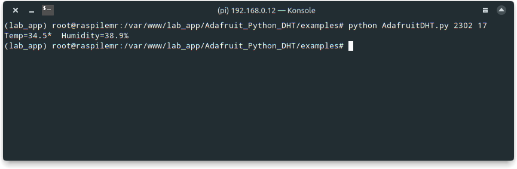

Ahora crearemos otra aplicación:

```bash
vim lab_app.py
```

En ella escribiremos el siguiente código:

```python
from flask import Flask, request, render_template
import sys
import Adafruit_DHT

app = Flask(__name__)
app.debug = True # Cambiar a False si ya no se va a depurar

@app.route("/")
def hello():
    return "¡Hola mundo!"

@app.route("/lab_temp")
def lab_temp():
	humidity, temperature = Adafruit_DHT.read_retry(Adafruit_DHT.AM2302, 17)
	if humidity is not None and temperature is not None:
		return render_template("lab_temp.html",temp=temperature,hum=humidity)
	else:
		return render_template("no_sensor.html")


if __name__ == "__main__":
    app.run(host='0.0.0.0', port=8080)
```

Debemos crear en el directorio _templates_ las plantillas a las que hace referencia nuestro código. Primero _no_sensor.html_:

```bash
vim no_sensor.html
```

Y ponemos en ella:

```html
<html>
 <head>
  </head>

<div class='test_container'>
  <h1>Lo sentimos, ¡no se puede acceder al sensor!</h1>
</div>
</html>
```

Y ahora creamos _lab_temp.html_:

```bash
vim lab_temp.html
```

Con lo siguiente en él:

```html
<html>
  <meta charset="utf-8">
  <title>Lab Conditions by RPi</title>
  <meta http-equiv="refresh" content="10">
  <meta name="description" content="Lab conditions - RPi">
  <!-- Mobile Specific Metas
  –––––––––––––––––––––––––––––––––––––––––––––––––– -->
  <meta name="viewport" content="width=device-width, initial-scale=1">
  <!-- FONT
  –––––––––––––––––––––––––––––––––––––––––––––––––– -->
  <link href="//fonts.googleapis.com/css?family=Raleway:400,300,600" rel="stylesheet" type="text/css">
  <!-- CSS
  –––––––––––––––––––––––––––––––––––––––––––––––––– -->
  <link rel="stylesheet" href="/static/css/normalize.css">
  <link rel="stylesheet" href="/static/css/skeleton.css">
  <!-- Favicon
  –––––––––––––––––––––––––––––––––––––––––––––––––– -->
  <link rel="icon" type="image/png" href="/static/images/favicon.png">
</head>
  <body>
    <div class="container">
      <div class="row">
        <div class="two-third column" style="margin-top: 5%">
            <h2>Condiciones en tiempo real</h2>
            <h1>Temperatura: {{"{0:0.1f}".format(temp) }}°C</h1>
            <h1>Humedad: {{"{0:0.1f}".format(hum)}}%</h1>  
            <p>Esta página se actualiza cada diez segundos</p>
        </div>   
      </div>
    </div>           
  </body>  
</html>
```

A continuación, debemos cambiar la aplicación que arrancará con el servidor, ya que ahora _hola-mundo.py_ no lo será ya. Entramos a _lab_app_uwsgi.ini_ y modificamos el módulo python a importar, escribiendo _lab_app_ en lugar de _hola-mundo_.

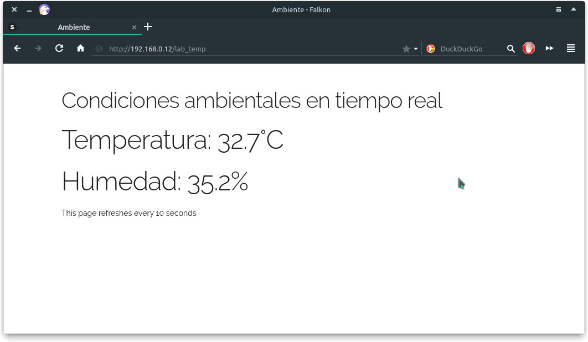

### Creando la base de datos

Como _root_, dentro de la carpeta _lab_app_ y con _Python_ activado, crearemos una nueva base de datos, en la cual almacenaremos las mediciones del sensor:

```bash
sqlite3 lab_app.db
```

Y seguimos los siguientes pasos para armar la tabla que contendrá las temperaturas:

```sqlite
sqlite> begin;
sqlite> create table temperatura (rDatetime datetime, sensorID text, temp numeric);
sqlite> insert into temperatura values (datetime(CURRENT_TIMESTAMP), "1", 25);
sqlite> insert into temperatura values (datetime(CURRENT_TIMESTAMP), "1", 25.10);
sqlite> commit;
```

Enseguida armamos la tabla de la humedad:

```sqlite
sqlite> begin;
sqlite> create table humedad (rDatetime datetime, sensorID text, hum numeric);
sqlite> insert into humedad values (datetime(CURRENT_TIMESTAMP), "1", 35);
sqlite> insert into humedad values (datetime(CURRENT_TIMESTAMP), "1", 35.50);
sqlite> commit;
```

Podemos observar los valores capturados con:

```sqlite
sqlite> select * from temperatura;
2019-07-13 05:13:24|1|25
2019-07-13 05:13:31|1|25.1
sqlite> select * from humedad;
2019-07-13 05:18:41|1|35
2019-07-13 05:18:48|1|35.5
```

Y ahora salgamos:

```sqlite
.exit
```

### Capturando los datos en la base de datos

Creamos un nuevo archivo llamado _env_log.py_ dentro del directorio de siempre y escribimos en él:

```python
import sqlite3
import sys
import Adafruit_DHT

def log_values(sensor_id, temp, hum):
	conn=sqlite3.connect('/var/www/lab_app/lab_app.db')
    curs=conn.cursor()
	curs.execute("""INSERT INTO temperatura values(datetime(CURRENT_TIMESTAMP, 'localtime'), (?), (?))""", (sensor_id,temp))
	curs.execute("""INSERT INTO humedad values(datetime(CURRENT_TIMESTAMP, 'localtime'), (?), (?))""", (sensor_id,hum))
	conn.commit()
	conn.close()
    
humidity, temperature = Adafruit_DHT.read_retry(Adafruit_DHT.AM2302, 17)
if humidity is not None and temperature is not None:
	log_values("1", temperature, humidity)	
else:
	log_values("1", -999, -999)
```

Guardamos los cambios en el archivo y lo ejecutamos:

```python
python env_log.py
```

Si todo sale bien, no debería de haber pasado nada. Entramos ahora a nuestra base de datos y comprobamos que haya sido guardada la reciente medición:

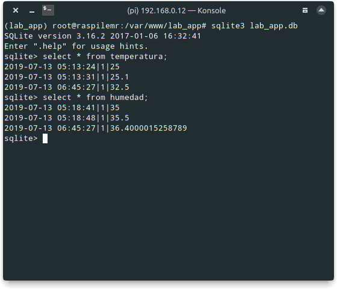

### Programar la lectura automáticamente

Para poder sensar la temperatura y humedad de manera automática, es decir, sin tener que estar ejecutando algún _script_ de manera manual, utilizaremos _cron_. En el mismo directorio donde hemos estado trabajando, ejecutamos:

```bash
crontab -e
```

Se nos pedirá que elijamos un editor de entre una lista de cuatro de ellos. El más sencillo es _nano_,  marcado con el número 2, aunque ya sabemos utilizar también _vim_. Escribimos un 2 para editar con _nano_. Al abrir el archivo, se nos muestra un texto que explica cómo deben ser definidas las tareas. Nos vamos al final del mismo para editar, donde podemos notar que ya tiene una estructura: primero la definición de los intervalos y luego el comando a ejecutar según dichos intervalos. Como sensaremos cada minuto y ejecutaremos, mediante _python_, nuestra última aplicación, escribimos lo siguiente:

```bash
*/1 * * * * /var/www/lab_app/bin/python /var/www/lab_app/env_log.py
```

Un buen sitio para obtener los valores adecuados para programar acciones en _cron_ es [crontab.guru](crontab.guru).

Ahora bien, esperamos a que transcurra aproximadamente el minuto y enseguida revisamos lo almacenado en nuestra base de datos, para comprobar el buen funcionamiento de nuestro _script_ en _cron_.

### Mostrando la base de datos en el navegador

Debemos realizar la conexión entre nuestra aplicación web y la base de datos de _sqlite3_. Para ello, entramos a nuestro archivo _lab_app.py_ y lo editamos, importando el módulo _sqlite3_ y luego agregando otra ruta:

```python
@app.route("/lab_env_db")
def lab_env_db():
	conn=sqlite3.connect('/var/www/lab_app/lab_app.db')
	curs=conn.cursor()
	curs.execute("SELECT * FROM temperatura")
	temperatura = curs.fetchall()
	curs.execute("SELECT * FROM humedad")
	humedad = curs.fetchall()
	conn.close()
	return render_template("lab_env_db.html",temp=temperatura,hum=humedad)
```

Guardamos los cambios. Ahora toca crear la plantilla _lab_env_db_html_ en el directorio _/templates_:

```html
<!DOCTYPE html>
<html lang="es">
  <head>
    <!-- Basic Page Needs
    –––––––––––––––––––––––––––––––––––––––––––––––––– -->
    <meta charset="utf-8">
    <title>Condiciones</title>
    <meta name="description" content="Condiciones ambientales">
    <!-- Mobile Specific Metas
    –––––––––––––––––––––––––––––––––––––––––––––––––– -->
    <meta name="viewport" content="width=device-width, initial-scale=1">
    <!-- FONT
    –––––––––––––––––––––––––––––––––––––––––––––––––– -->
    <link href="//fonts.googleapis.com/css?family=Raleway:400,300,600" rel="stylesheet" type="text/css">
    <!-- CSS
    –––––––––––––––––––––––––––––––––––––––––––––––––– -->
    <link rel="stylesheet" href="/static/css/normalize.css">
    <link rel="stylesheet" href="/static/css/skeleton.css">
    <!-- Favicon
    –––––––––––––––––––––––––––––––––––––––––––––––––– -->
    <link rel="icon" type="image/png" href="/static/images/favicon.png">
  </head>
  <body>
    <div class="container">
      <div class="row">
        <div class="one-third column" style="margin-top: 5%">
          <strong>Mostrando todos los valores</strong>                
          <h2>Temperaturas</h2>                    
            <table class="u-full-width">
              <thead>
                <tr>
                  <th>Fecha</th>
                  <th>&deg;C</th>                        
                </tr>
              </thead>
              <tbody>
                
                <tr>
                  <td>{{row[0]}}</td>
                  <td>{{'%0.2f'|format(row[2])}}</td>
                </tr>
                
              </tbody>
            </table>  
            <h2>Humedad</h2>
            <table class="u-full-width">
              <thead>
                <tr>
                  <th>Fecha</th>
                  <th>%</th>                        
                </tr>
              </thead>
              <tbody>
                
                <tr>
                  <td>{{row[0]}}</td>
                  <td>{{'%0.2f'|format(row[2])}}</td>
                </tr>          
                
              </tbody>
            </table>                                              
        </div>
    </div>           
  </body>
</html>
```

Toca reiniciar el servicio _uWSGI_ y verificar el funcionamiento:

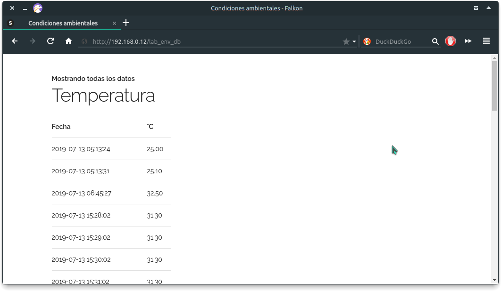

## Mejorando la aplicación web

Para mejorar la presentación de nuestra aplicación, implementaremos la selección de rangos mediante botones.

### Implementando la selección de rangos en las mediciones

Recordemos la selección de valores en _sqlite3_:

```sqlite
sqlite> select * from temperatura where rDatetime between "2019-07-13 15:30:02" and "2019-07-14 17:00:02";
```

Con eso en mente, editaremos nuestro archivo _lab_app.py_ para agregar la funcionalidad del filtrado de observaciones. Debemos agregar más módulos, en este caso, _time_ y _datetime_; y enseguida, editaremos la app _lab_env_db_:

```python
@app.route("/lab_env_db", methods=['GET'])
def lab_env_db():
    from_date_str = request.args.get('from',time.strftime("%Y-%m-%d %H:%M"))
    to_date_str = request.args.get('to',time.strftime("%Y-%m-%d %H:%M"))

    conn=sqlite3.connect('/var/www/lab_app/lab_app.db')
    curs=conn.cursor()
    #curs.execute("SELECT * FROM temperatura")
    #temperatura = curs.fetchall()
    #curs.execute("SELECT * FROM humedad")
    #humedad = curs.fetchall()
    curs.execute("SELECT * FROM temperatura WHERE rDateTime BETWEEN ? AND ?", (from_date_str, to_date_str))
    temperatura = curs.fetchall()
    curs.execute("SELECT * FROM humedad WHERE rDateTime BETWEEN ? AND ?", (from_date_str, to_date_str))
    humedad = curs.fetchall()
    conn.close()
    return render_template("lab_env_db.html",temp=temperatura,hum=humedad)
```

Hacemos una prueba de verificación, filtrando por día y hora:


Si queremos validar que las fechas sean correctas, podemos agregar dicha funcionalidad en nuestra _lab_app_:

```python
def validate_date(d):
    try:
        datetime.datetime.strptime(d, '%Y-%m-%d %H:%M')
        return True
    except ValueError:
        return False
```

Y más específicamente, en nuestra ruta _lab_env_db_ agregamos el siguiente código antes de la línea `conn=sqlite3.connect`:

```python
if not validate_date(from_date_str):
    from_date_str = time.strftime("%Y-%m-%d 00:00")
if not validate_date(to_date_str):
	to_date_str = time.strftime("%Y-%m-%d %H:%M")
```

Guardamos y reiniciamos _emperor.uwsgi.service_. Si en un momento dado, nuestro filtrado está mal escrito, la página devolverá todas las observaciones.

### Optimizando el código

Podemos mejorar el código, dejándolo definitivamente como sigue:

```python
from flask import Flask, request, render_template
import time
import datetime
import sys
import Adafruit_DHT
import sqlite3

app = Flask(__name__)
app.debug = True

@app.route("/")
def hello():
    return "¡Hola mundo!"

@app.route("/lab_temp")
def lab_temp():
    humidity, temperature = Adafruit_DHT.read_retry(Adafruit_DHT.AM2302, 17)
    if humidity is not None and temperature is not None:
        return render_template("lab_temp.html",temp=temperature,hum=humidity)
    else:
        return render_template("no_sensor.html")

@app.route("/lab_env_db", methods=['GET'])
def lab_env_db():
    temperatura, humedad, from_date_str, to_date_str=get_records()
    return render_template("lab_env_db.html", temp=temperatura, hum=humedad)

def get_records():
    from_date_str = request.args.get('from',time.strftime("%Y-%m-%d %H:%M"))
    to_date_str = request.args.get('to',time.strftime("%Y-%m-%d %H:%M"))
    if not validate_date(from_date_str):
        from_date_str = time.strftime("%Y-%m-%d 00:00")
    if not validate_date(to_date_str):
        to_date_str = time.strftime("%Y-%m-%d %H:%M")

    conn=sqlite3.connect('/var/www/lab_app/lab_app.db')
    curs=conn.cursor()
    #curs.execute("SELECT * FROM temperatura")
    #temperatura = curs.fetchall()
    #curs.execute("SELECT * FROM humedad")
    #humedad = curs.fetchall()
    curs.execute("SELECT * FROM temperatura WHERE rDateTime BETWEEN ? AND ?", (from_date_str, to_date_str))
    temperatura = curs.fetchall()
    curs.execute("SELECT * FROM humedad WHERE rDateTime BETWEEN ? AND ?", (from_date_str, to_date_str))
    humedad = curs.fetchall()
    conn.close()
    return [temperatura, humedad, from_date_str, to_date_str]
    
def validate_date(d):
    try:
        datetime.datetime.strptime(d, '%Y-%m-%d %H:%M')
        return True
    except ValueError:
        return False

if __name__ == "__main__":
    app.run(host='0.0.0.0', port=8080)
```


