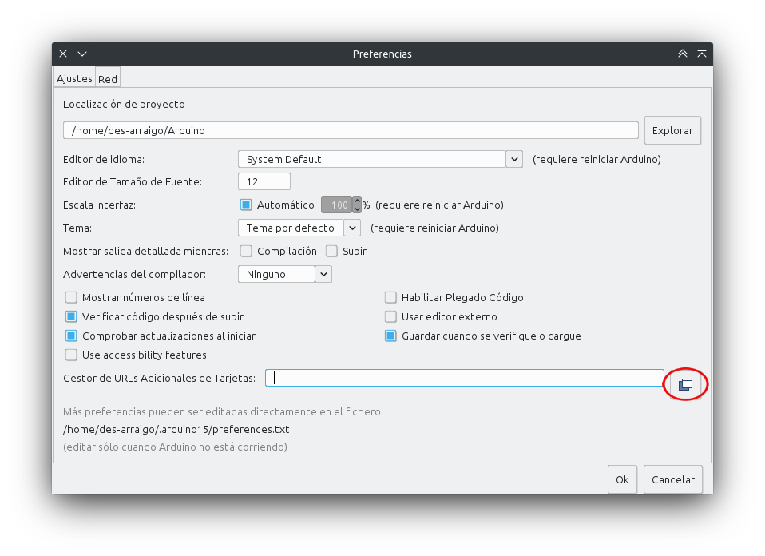
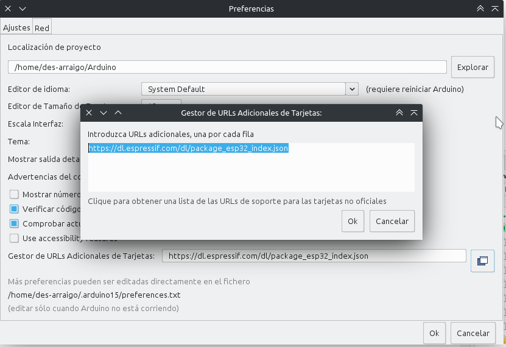
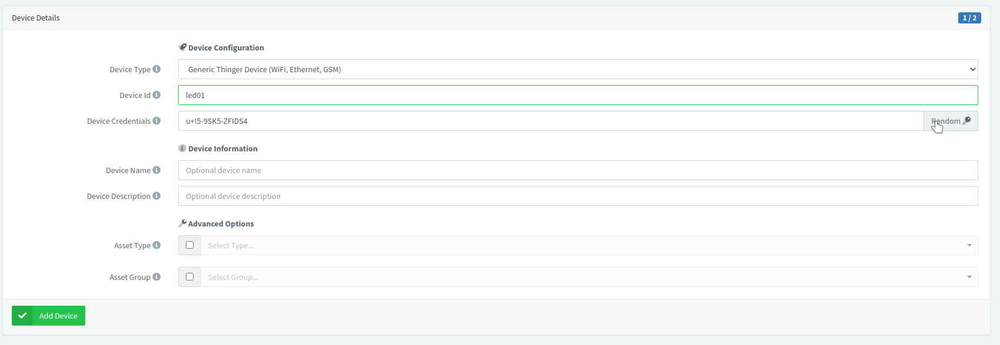

## Introducción

Arduino es una placa bastante versátil en cuanto a sus capacidades, pero es de todos conocido que la versión básica UNO no cuenta con conectividad WiFi ni Bluetooth de forma nativa. Esto nos obliga a adquirir hardware adicional que nos permita expandir la placa. Entre una de las opciones tradicionalmente más utilizadas para paliar esta carencia se encuentra el Sistema Embebido (Sistema en un Chip o System on a Chip, SoC) ESP8266, el cual ha sido desarrollado por Espressif Systems, organización de origen chino. Sin embargo, esta misma organización ya ha desarrollado a la placa sucesora, llamada ESP32 que integra lo siguiente: 

- Wi-Fi (Banda de 2.4 GHz - 802.11 b/g/n)

- Bluetooth 4.2 BR/EDR y de baja energía (BLE)

- CPU Dual Core Tensilica Xtensa LX6 de 32-bit y hasta 240 MHz

- Co-procesador de Ultra Baja Energía

- 448 KiB ROM

- 512 KiB SRAM

Entre las conexiones y protocolos soportados, ESP32 cuenta con

- 38 pines de conexión, incluyendo los pines para alimentación de energía de 5 y 3.3v, además de la tierra

- Conversor analógico-digital y digital-analógico

- I2C

- UART

- CAN 2.0

- SPI

- I2S

- RMII

- Ethernet

- PWM, entre otros.

En cuanto a la seguridad, se soporta:

- Estándares IEEE 802.11, incluyendo WFA, WPA/WPA2 and WAPI

- Arranque seguro

- Encriptación Flash

- Criptografía por aceleración de hardware: AES, SHA-2, RSA, ECC, generador real de números aleatorios (RNG).

Aún se puede seguir enumerando más características, pero estas son las más llamativas. En cuanto a los componentes físicos necesarios para poder trabajar con ESP32 se encuentra obviamente la propia placa, una computadora ejecutando Windows, Linux o MacOS y un cable micro-USB. Y en cuanto al software, se cuenta con varias alternativas: 

- __Toolchain__ para compilar el código

- Herramientas como CMake y Ninja para construir las apps

- __ESP-IDF__ que contiene la API para la ESP32 y scripts para operar la toolchain

Se puede optar por utilizar los plugins para los IDE Eclipse o VS Code, incluso se puede preferir irse por la IDE de Arduino, para programar con los mismos comandos o el add-on PlatformIO que está disponible tanto para VS Code como Atom. Cabe mencionar que utilizaremos estas últimas opciones para reutilizar algunos sketches realizados con Arduino.

## Diagrama de ESP32

Antes de comenzar a manipular la placa ESP32, debemos conocer su cableado. Cuenta con 38 pines, de los cuales tres son tierra, uno es para alimentarla con 3.3v y otro para alimentarle con 5v. De todos modos, se recomienda utilizar el puerto micro-USB para proveerle de energía. El siguiente diagrama es para el módulo NodeMCU-32S, visto de manera que el puerto micro-USB quede hacia abajo. Este módulo es bastante común y es muy probable que sea el primero que se consiga.


Es posible utilizar todos los pines cuyo nombre comienza con GPIO, aunque cabe mencionar que no todos cuentan con el conversor analógico-digital. Puede observarse un pin llamado __EN__, el cual permite entrar en modo _run_, es decir, ejecutar el programa cargado. Es posible descargar la hoja técnica para este módulo en el siguiente  [enlace](https://www.electrosoftcloud.com/wp-content/uploads/2021/04/esp32-wroom-32_datasheet_en.pdf). Si se cuenta con otro módulo, puede buscarse su hoja técnica en la página del fabricante o probablemente encontrarla en la siguiente [página](https://www.espressif.com/en/support/documents/technical-documents).

## Instalación

Como se mencionó anteriormente, utilizaremos lo que ya sabemos de arduino para trabajar con ESP32. Para ello usaremos la IDE de arduino, aunque de momento la tarjeta no se encuentra en los repositorios oficiales, así que debemos instalar uno de manera manual. Con la IDE abierta nos vamos al menú `Archivo -> Preferencias`. Al abrirse esta ventana nueva, en la pestaña `Ajustes` nos dirigimos a la parte inferior y buscamos la caja de texto al lado de `Gestor de URLs adicionales de Tarjetas`. 



Damos clic en el botón indicado en la imagen y se abrirá otra ventana más. Ahí pegamos la siguiente dirección: https://dl.espressif.com/dl/package_esp32_index.json y damos clic en OK.



Nos dirigimos ahora al menú `Herramientas -> Placa: -> Gestor de Tarjetas`, apareciendo una ventana donde buscaremos en la caja de texto «esp32». Aparecerá nuestro dispositivo y damos clic en el botón de instalar:


Ahora toca seleccionar nuestra placa. Conectamos la ESP32 por medio del cable usb - micro-usb a nuestra computadora y debería ser reconocida al instante. En el menú `Herramientas -> Placa: -> ESP32 Arduino` buscamos nuestro modelo de placa. Si tenemos la NodeMCU-32S sí aparecerá tal cual. En caso de contar con otro modelo, basta con utilizar la opción genérica «ESP32 Dev Module». Enseguida seleccionamos el puerto COM donde se encuentra nuestra ESP32 y ya estamos en condiciones de subir nuestro _sketch_. Cabe mencionar que el caso del módulo NodeMCU-32S debe dejarse presionado el botón _BOOT_ mientras se carga un _sketch_.

## Prácticas

Comenzaremos con un par de prácticas. La primera será una adaptación de la Práctica 01 con Arduino, mientras que en la segunda nos conectaremos a una red WiFi con la ESP32.

### Práctica 01. Encendiendo un led.

La lista de materiales, el circuito y el código son básicamente los mismos que en Arduino.

#### Materiales

- Led de color indistinto

- Resistencia de al menos 220$\Omega$

- Tablilla de prototipado

- ESP32

#### Circuito

Armamos el circuito conectando la patilla corta del led a la resistencia y ésta a su vez a la tierra GND de la ESP32 (pin superior derecho, observando la placa con el puerto micro-usb apuntando hacia abajo). La patilla larga del led se conecta al pin 23 (se encuentra al lado del pin de tierra) 

#### Código

```{C++}
// Descomentar la siguiente línea si no se utiliza Arduino IDE
// #include <Arduino.h> 

const int led = 23;

void setup() {
    pinMode(led, OUTPUT);
}

void loop() {
    digitalWrite(led, HIGH);   
    delay(1000);                 
    digitalWrite(led, LOW);    
    delay(1000)
}
```

### Sobre cierto error de comunicación

Anteriormente ya se mencionó pero cabe repetirlo. La placa NodeMCU-32S tiene algo peculiar. Si al momento de subir un _sketch_ no se presiona el botón _BOOT_ ocurrirá un error de comunicación. Por lo tanto, al momento de enviar el archivo a la placa, presione dicho botón hasta que la terminal indique que se está escribiendo en la placa. Si no ha surgido el error, presione el otro botón de la placa (EN) para activar el modo _ejecución_. Sería todo.

### Práctica 02. Conectándose a una red WiFi

Sin circuito de por medio y con solo la placa conectada a la PC con su respectivo cable. Lógicamente es necesario que haya una red WiFi en las cercanías y que conozcamos tanto su SSID como su contraseña.

#### Materiales

- Placa ESP32

- Una red WiFi conocida

#### Código

El siguiente código permite conectarse a una red WiFi de la cual conocemos los datos de acceso, a la vez que nos indica su estado. Es decir, nos estará mostrando si está conectándose y de lograrlo, nos indicará en la consola la dirección IP que haya obtenido.

```{C++}

// descomentar la siguiente línea si no se utiliza Arduino IDE
//#include <Arduino.h>
#include <WiFi.h>

const char* ssid = "TuSSID";
const char* password = "TuPassWord";

void setup() {
  Serial.begin(115200);
  delay(10);

  Serial.println("");
  Serial.println("");

  Serial.print("Conectando a --> ");
  Serial.println(ssid);

  // nos conectamos

  WiFi.begin(ssid, password);

  while (WiFi.status() != WL_CONNECTED) {
    Serial.print(".");
    delay(250);
  }

  Serial.println("");
  Serial.println("Conexión exitosa");

  Serial.print("Mi ip es --> ");
  Serial.println(WiFi.localIP());

}

void loop() {
  
}
```

### Práctica 03. Controlando un led de manera remota

Para entrar a lo que es propiamente el Internet de las Cosas, resulta necesario poder conectar nuestro sistema embebido a una red (conseguido mediante wifi en la práctica anterior), para así controlar dispositivos a la distancia. En esta ocasión veremos cómo controlar el encendido de un led mediante otro dispositivo conectado no necesariamente a la misma red, pero sí a internet como tal. Lo primero a realizar será crearnos una cuenta en algún sitio que nos permita dicha conexión, por ejemplo CloudMQTT o thinger.io. 

#### Materiales

- Una cuenta en thinger.io

- Led de color indistinto

- Resistencia de al menos 220$\Omega$

- Placa ESP32

- Conexión a internet por WiFi

- Dispositivo externo (laptop, teléfono celular, tableta, etc)

- Cables necesarios

- Tablilla de prototipado

#### Circuito

El de toda la vida. Solo hay que asegurarse de conectar la patilla corta del led a la resistencia y de ahí a tierra (pin GND, ubicado a la derecha, parte superior de la placa viéndola con el puerto micro-USB apuntando hacia abajo) y la patilla larga al pin 23, que está justo al lado de GND)

#### Código

Aquí viene toda la parte pesada. Por principio de cuentas, hay que crearse una cuenta en [thinger.io](thinger.io), dando nombre de usuario y una contraseña. No nos preocupemos, es gratuita. Luego se nos envía un correo para validar la cuenta y activarla. Al hacerlo, nos manda a la pantalla de _login_ y ahí introducimos nuestros datos. Nos va a mostrar la siguiente pantalla:


No hay mucho que hacer por aquí. Nos dirigimos a la parte izquierda y damos clic en _Devices_ y luego en el botón de la pantalla principal _Add device__:


Enseguida nos envía a la siguiente pantalla donde debemos colocar ciertos parámetros:


En la priemra opción dejamos como genérico (WiFi, Ethernet, GSM), escribiendo en la segunda alguna identificación sencilla (como led01, por ejemplo) y para la credencial del dispositivo podemos dar clic en el botón _Random_ para crearnos una:



Y listo. Ya tenemos nuestro dispositivo dado de alta y contando como uno de los dos a los que tenemos acceso de manera gratuita. La web nos mostrará lo siguiente:


Ahora nos dirigiremos al Arduino IDE para instalar las librerías necesarias para interactuar con thinger. Damos clic en `Programa -> Incluir librería -> Administrar bibliotecas` y se nos mostrará una ventana donde buscaremos e instalaremos _thinger.io by Alvaro Luis Bustamante_. 


Ahora sí, procedemos a escribir nuestro código o reutilizar el que viene de ejemplo:

```{C++}
#include <ThingerESP32.h>

#define USERNAME "your_user_name"  //nombre de usuario en thinger
#define DEVICE_ID "your_device_id"  //el nombre que le dimos al dispositivo
#define DEVICE_CREDENTIAL "your_device_credential"  //la secuencia de caracteres que generamos

#define SSID "your_wifi_ssid"
#define SSID_PASSWORD "your_wifi_ssid_password"

ThingerESP32 thing(USERNAME, DEVICE_ID, DEVICE_CREDENTIAL);

void setup() {
  pinMode(LED_BUILTIN, OUTPUT);  //configuramos el led ya incluido

  thing.add_wifi(SSID, SSID_PASSWORD);

  // digital pin control example (i.e. turning on/off a light, a relay, configuring a parameter, etc)
  thing["led"] << digitalPin(LED_BUILTIN);

  // resource output example (i.e. reading a sensor value)
  thing["millis"] >> outputValue(millis());
}

void loop() {
  thing.handle();
}
```


